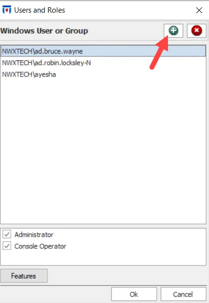

# Add Users

Follow the steps to add a user and assign access rights.

__Step 1 –__ Click __Configuration__ > __Users__ on the menu to open the Users and Roles window.

__Step 2 –__ Click the __Add__ (+) button in the upper-right corner; the Select Users or Groups window opens.

__Step 3 –__ Enter the name of the desired user in the Enter the object names to select box and click Check Name. On the next window, select the required Active Directory user and click __OK__. Click __OK__ on the Select Users or Groups window to close it. The user is added to the Windows User or Group list.

__Step 4 –__ At the bottom of the Users and Roles window, two user roles, Administrator and Console Operator, are displayed. Select the checkbox for a role to assign it to the user. Checking Administrator automatically checks the Console Operator role.

_Remember,_ the Report User role was a legacy role for the IIS-based SI Reporting Console and does not apply to the Netwrix Threat Manager Reporting Module console. See the [User Access Page](../../../reportingmodule/configuration/systemsettings/useraccess.md) topic for information on granting report access.

__Step 5 –__ _(Optional)_ Create as many users as required before clicking OK.

__Step 6 –__ Click __OK__ to save changes on the Users and Roles window.

User(s) now have the appropriate access rights applied.
