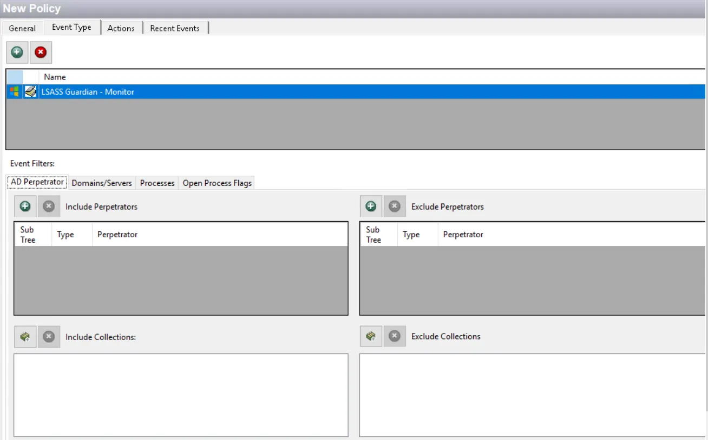
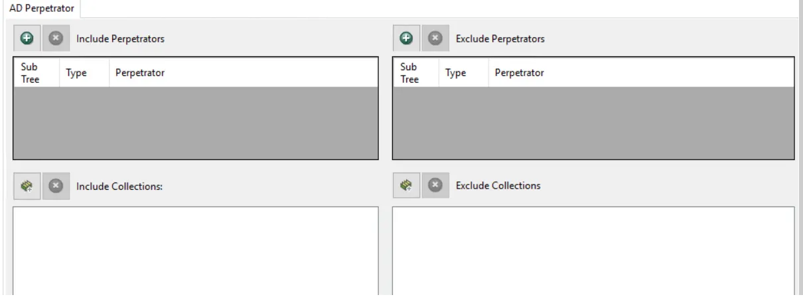
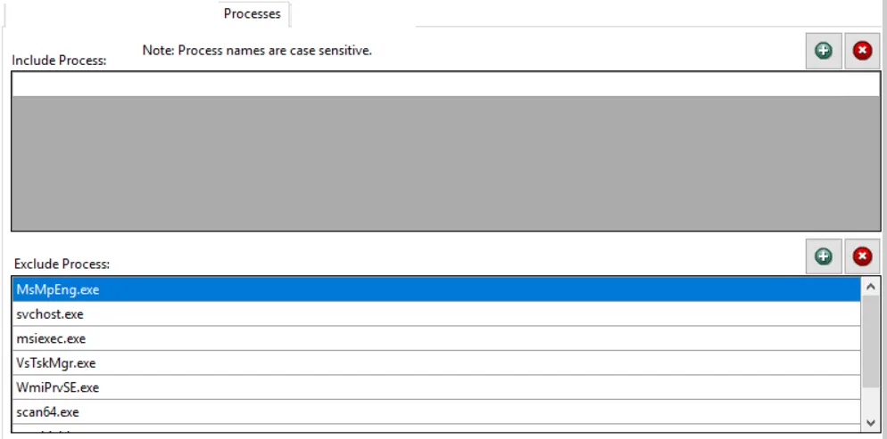
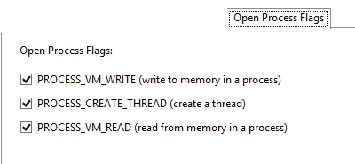

# LSASS Guardian – Monitor Event Type

Based on policy rules, the LSASS Guardian – Monitor event type generates an event when a process not in the ‘white list’ attempts to access the LSASS process. Access options include Write, Read and Create Thread.

The event filters for the LSASS Guardian – Monitor event type are:

- AD Perpetrator
- Domains/Servers
- Processes
- Open Process Flags

Each filter tab acts like an "AND" statement for the filter. Any filter tab left blank is treated like an "ALL" for that filter set.

___RECOMMENDED:___ Add exclusion process filters for undesired processes that make changes to LSASS, e.g. third-party malware applications.

## AD Perpetrator Filter

Use the AD Perpetrator filter for monitoring to set the scope of the policy to only monitor specific security principals committing changes or to exclude specific security principals committing changes from being monitored.

Use the buttons in the Include Perpetrators, Include Collections, Exclude Perpetrators, and Exclude Collections areas to edit the lists.

- The Perpetrators Add (+) button opens the [Select Active Directory Perpetrators Window](window/selectactivedirectory/perpetrators.md).
- The Collection button opens the [List of Collections Window](../../configuration/collectionmanager/listcollections.md) to the appropriate Collection category.
- The Remove (x) button deletes the selected item(s) from that box.

__NOTE:__ To enable a Dynamic Policy, use the Collection button to select the desired Dynamic Collection. See the [Dynamic Collections](../../configuration/collectionmanager/dynamic.md) topic for additional information.

Sub Tree

When contexts are added, a Sub-Tree checkbox displays. Check it to apply the filter to the parent and all child contexts. Uncheck it to apply the filter to the listed context only.

## Domains/Servers Filter

Use the Domains/Servers filter to set the scope of the policy to specific domains and/or servers or to exclude specific domains and/or servers.

Use the buttons in the Include and Exclude areas to edit the lists.

- The Add (+) buttons open the [Select Domains and Servers Window](window/selectdomainsservers.md).
- The Collection button opens the [List of Collections Window](../../configuration/collectionmanager/listcollections.md) to the appropriate Collection category.
- The Remove (x) button deletes the selected item(s) from that box.

__NOTE:__ To enable a Dynamic Policy, use the Collection button to select the desired Dynamic Collection. See the [Dynamic Collections](../../configuration/collectionmanager/dynamic.md) topic for additional information.

## Processes Filter

magUse the Processes filter to set the scope of the policy to only monitor specific processes or exclude specific processes from being monitored.

___RECOMMENDED:___  Add undesired processes that make changes to LSASS, e.g. third-party malware applications, to the Exclude Process list.

Type the process in the textbox for the desired option: Include Process or Exclude Process. Use the buttons in the respective areas to edit the lists.

- The Process __Add__ (+) button adds a textbox to the list to add an additional process.
- The Remove (x) button deletes the selected item(s) from that box.

__CAUTION:__ In a production environment, only exclude processes using the Exclude Process area. While there is an option to include processes, it is NOT recommended in a policy that is monitoring a production environment. Adding a process in the Include Process area limits the policy to only monitoring that process. Unknown malicious processes would not be monitored by the policy. In a sandbox environment, the Include Process option can be useful for testing/capturing the LSASS activity for specific processes to see what access they are requesting.

## Open Process Flags Filter

Use the Open Process Flags filter to set the scope of the policy for requested handles that would maliciously impact LSASS.

Check the box to select the process flag(s) to be monitored. This will trigger an event if the request for an LSASS handle contains one or more of the selected process flags.

- PROCESS_VM_WRITE – Select this checkbox to write to memory in a process
- PROCESS_CREATE_THREAD – Select this checkbox to create a thread
- PROCESS_VM_READ – Select this checkbox to report if the calling process, such as an application, wants to read LSASS memory  
  - A typical use case for this is the creation of an LSASS dump file, since read rights are required to create a dump file of the process.
  - Uncheck this checkbox to not generate an event if the calling process, such as an application, requests LSASS memory read access.

___RECOMMENDED:___ Leave these filters enabled. Do not deselect these options.
