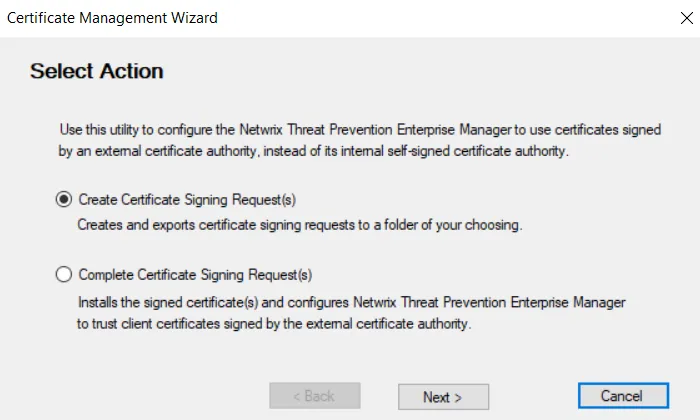
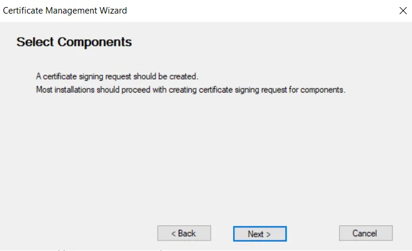
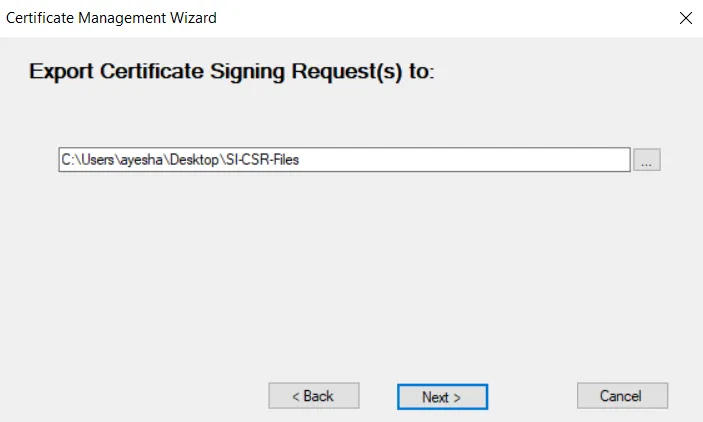
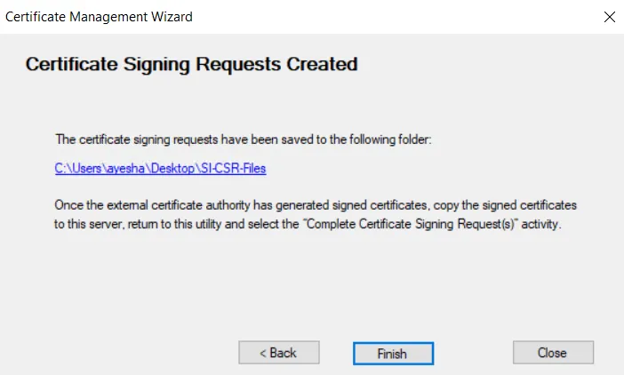
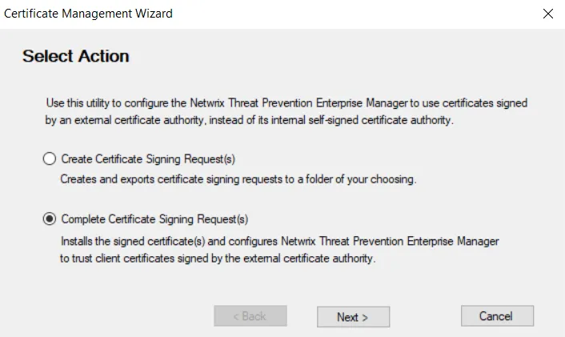
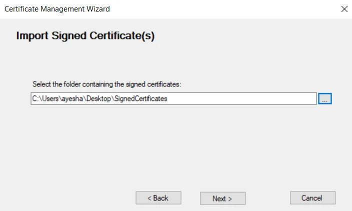
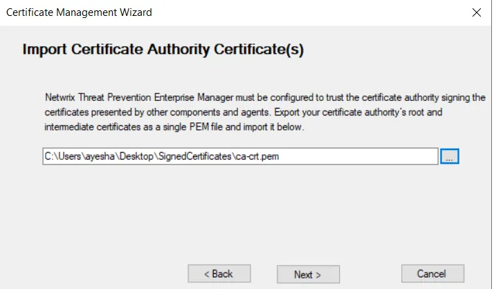
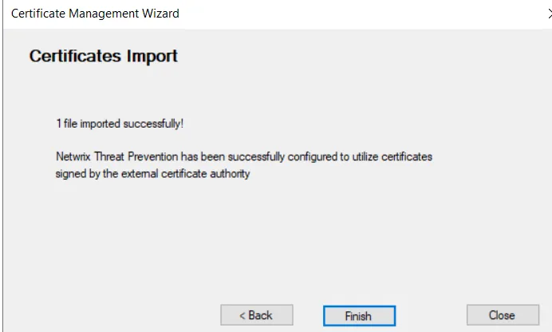

# Certificate Management Wizard

The Certificate Management Wizard is a standalone component used to configure Threat Prevention Enterprise Manager to use custom managed certificates that are created and signed by an external certificate authority. This provides customers with the option to use certificates signed by their certificate authority instead of the default certificate authority in Threat Prevention Enterprise Manager.

__NOTE:__ As a requirement for using custom managed certificates, you must provide the Enterprise Manager server DNS name, hostname, or FQDN (instead of the IP address) when installing the following:

- Threat Prevention server
- Remote instance of the Administration Console
- Agent

See the [Administration Console and Agent Not Communicating with the Enterprise Manager ](../troubleshooting/enterprisemanagercommunication.md)topics for additional information.

How to use the Certificate Management Wizard

The Certificate Management Wizard must be run twice to perform two actions.

- The first action creates and exports certificate signing requests to a specified folder.
- The second action installs the signed certificate and configures Threat Prevention Enterprise Manager to trust client certificates signed by the customer's certificate authority.

The Certificate Manager Wizard application, ```SICertMgr.exe```, is available in the following folder:

...\Netwrix\Netwrix Threat Prevention\SIEnterpriseManager

The Threat Prevention installer generates default certificates, that are located in the following folder:

...\Netwrix\Netwrix Threat Prevention\SIEnterpriseManager\CertsInfo

## Create a Certificate Signing Request

Follow the steps to create and export a certificate signing request to a specified folder.

__Step 1 –__ Identify the certificate authority you will use to generate the signed certificates.

__Step 2 –__ Open the Services explorer window (services.msc) and stop the Netwrix Threat Prevention Enterprise Manager service.

__Step 3 –__ Navigate to the directory containing ```SICertMgr.exe```. Right-click on the application and select __Run as Administrator__. The Certificate Management Wizard opens.



__Step 4 –__ On the Select Action page, select __Create Certificate Signing Request(s)__. This action creates and exports a certificate signing request to a designated folder. Click __Next__.



__Step 5 –__ On the Select Components page, click __Next__ to proceed with creating a certificate signing request for the Enterprise Manager.



__Step 6 –__ On the Export Certificate Signing Request(s) to page, select the folder to place the certificate request file. Click __Next__ to generate the file.

The following file is created and placed in the specified folder:

- em-csr.pem

The following files are placed in the ```...\Netwrix\Netwrix Threat Prevention\SIEnterpriseManager\CertsInfo``` folder:

- Secret.dpapi
- Ca-crt.pem
- Ca-key.pem (absent if custom signed)
- Em-crt.pem (private key)
- EM-key.pem (private key)



__Step 7 –__ The Certificate Signing Requests Created page is displayed when the certificate signing request has been created. Click __Finish__.

__Step 8 –__ Copy the signed certificates from the SI-CSR-Files folder to your certificate authority and generate the signed certificates.

__NOTE:__ The procedure to sign the certificates will vary based on the certificate authority used.

__Step 9 –__ Copy the signed certificates from your certificate authority and paste them to any folder on the Threat Prevention server.

When copied, run the Certificate Management Wizard again to complete the certificate signing request(s).

## Complete a Certificate Signing Request

Follow the steps to complete a certificate signing request.

__Step 1 –__ Navigate to the directory containing ```SICertMgr.exe```. Right-click on the application and select __Run as Administrator__. The Certificate Management Wizard opens.



__Step 2 –__ On the Select Action page, select __Complete Certificate Signing Request(s)__. This action installs the signed certificate and configures Threat Prevention Enterprise Manager to trust the client certificate signed by the customer's certificate authority. Click __Next__.



__Step 3 –__ On the Import Signed Certificate(s) page, select the folder containing the signed certificates. Then click __Next__.



__Step 4 –__ On the Import Certificate Authority Certificate(s) page, select the PEM file containing your certificate authority's root and intermediate certificates. Click __Next__.



__Step 5 –__ The Certificates Import page displays the number of files imported. Click __Finish__ to close the wizard.

The "\*.pem" files are imported to the following folder:  
```...\Netwrix\Netwrix Threat Prevention\SIEnterpriseManager\CertsInfo```

__Step 6 –__ Restart the Threat Prevention Enterprise Manager service.

Threat Prevention has been successfully configured to use certificates signed by the customer's certificate authority.
