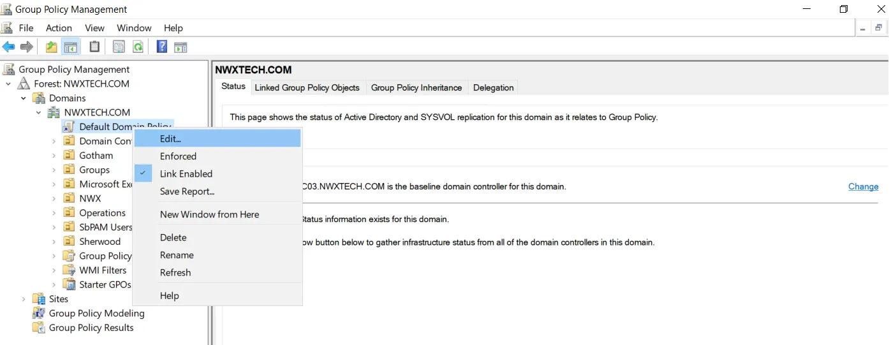

# EPE User Feedback Module

You can choose to install the optional Enterprise Password Enforcer (EPE) User Feedback module for
the Password Enforcement event type. This module has no impact on the application of EPE rules. It
only provides feedback to end users by listing the reasons EPE rejected a candidate password.

While rejecting a password, EPE displays the reasons for rejected to the user. If no reasons are
shown, then the password was rejected by the OS prior to being evaluated by EPE.

**NOTE:** For multilingual support, you must uninstall a previous version of the Credential Provider
and reinstall the Credential Provider that comes with Threat Prevention 7.4.

## Credential Provider Server Requirements

The server requirements to install the Threat Prevention Windows Credential Provider on a Windows
server or workstation are:

- All Windows Workstation and Servers using Windows Vista or later that are Domain members

## Deploy the EPE User Feedback Module

Follow the steps to deploy the EPE User Feedback module.

**Step 1 –** Ensure the **Enable EPE User Feedback Module** checkbox is selected on the
[EPE Settings Window](../admin/configuration/epesettings.md).

**Step 2 –** Run “Netwrix Threat Prevention Credential Provider GPO x64.msi” on one domain
controller per domain. This creates a GPO named _Enterprise Password Enforcer_, which provides
client machines with the pre password change static text messages defined in the GPO.

This msi file is available in the following folder on the Threat Prevention server:

`…\Netwrix\Netwrix Threat Prevention\SIWinConsole\Setup`

**Step 3 –** Run the 32bit or 64bit Credential Provider msi on the end user machine.

- Netwrix Threat Prevention Credential Provider x32.msi
- Netwrix Threat Prevention Credential Provider x64.msi

These msi files are located in the `…\Netwrix\Netwrix Threat Prevention\SIWinConsole\Setup` folder
on the Threat Prevention server.

**NOTE:** To uninstall this module, use Programs & Features in Control Panel to select the
SICredentialProviderx64 or x32.

## Configure Static User Text for the Windows Login Screen

The _Enterprise Password Enforcer_ GPO contains static text that the EPE User Feedback module
displays on the login screen. Typically this text would be edited by the Threat Prevention
administrator to describe password policy rules to provide guidance to end users prior to typing in
a new password.

Edit the Enterprise Password Enforcer GPO to modify the text displayed to the end-users. You can
change up to ten lines of text.

Access the Enterprise Password Enforcer GPO

**Step 1 –** Launch the Group Policy Management console (gpmc.msc).

**Step 2 –** Expand **Forest: [Name] > Domains > [Domain name]** and right-click **Default Domain
Policy**. Select **Edit** on the shortcut menu. The Group Policy Management Editor opens.

**Step 3 –** Expand **Computer Configuration > Policies > Administrative Templates Policy
definitions (ADMX files) retrieved from the local computer > STEALTHbits** to locate the Enterprise
Password Enforcer GPO under it.

**Step 4 –** Click the GPO. The adjacent pane displays text as _Set the text to show for password
policy when a user attempts to change their password_. Click it to view the description (the text
displayed to the end-users) and double-click it to change the description.
