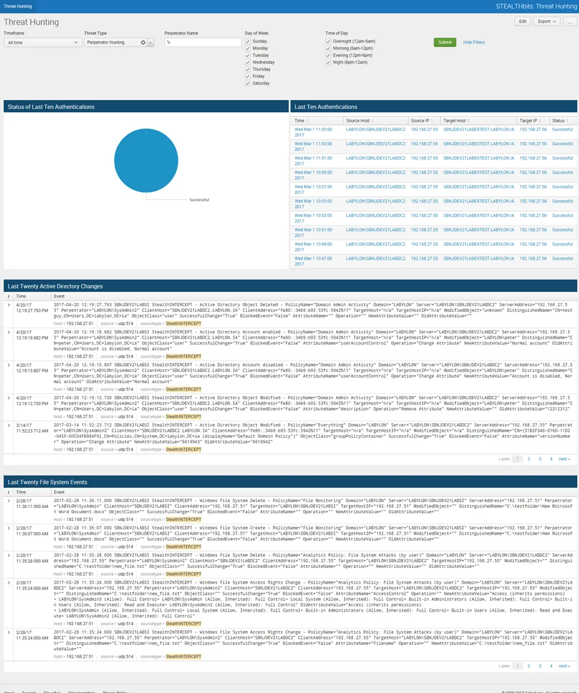

# Perpetrator Hunting

The Perpetrator Hunting option uses the Perpetrator Name field to determine which user is targeted
when searching for threats. Wildcard characters (%) are allowed.

The Perpetrator Hunting option contains the following cards:

- Status of Last Ten Authentications – Shows the status of the last ten authentications recorded in
  the specified timeframe. The values are either Successful, Failed, or Blocked.
- Last Ten Authentications –Shows the details of the last ten authentications recorded in the
  specified timeframe
- Last Twenty Active Directory Changes – Shows the last twenty Active Directory changes recorded in
  the specified timeframe
- Last Twenty File System Events – Shows the last twenty File System events recorded in the
  specified timeframe

The specified timeframe is set by default to _All Time_.
