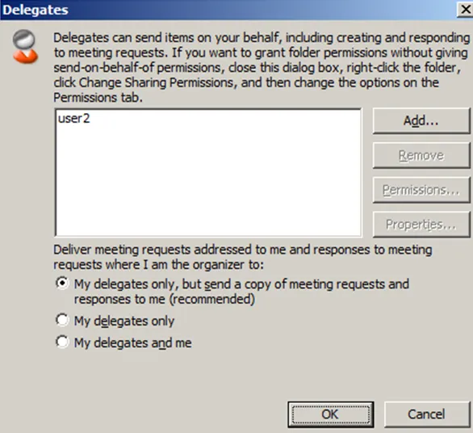
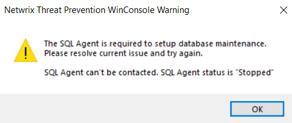
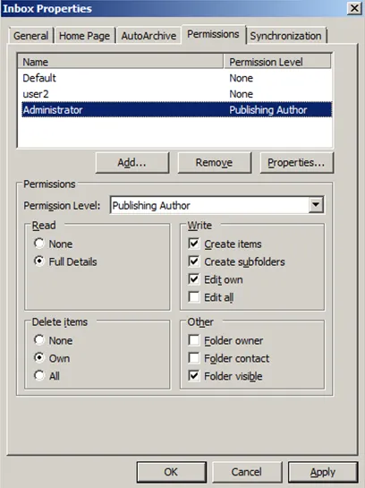

# Exchange Lockdown Considerations

When an Exchange Lockdown policy is first enabled, operations that are expected to be locked down by
the policy may not be blocked due to existing connections. It is necessary to ensure the users are
logged off before testing the blocking behavior of the policy. Following is the safest way to
resolve existing connections and ensure that events intended to be blocked are being blocked:

- For Outlook – Restart the MSExchangeRPC service
- For w3wp clients (e.g. OWA, PowerShell, EWS, ECP, ActiveSync) – Restart IIS

## Delegations through Outlook

In Microsoft Outlook 2010, delegation through Outlook performs three operations:

- The delegate acquires **Send on Behalf of** permission for the user’s mailbox
- Outlook updates the ACLs for individual mailbox folders with the permissions that were set for the
  delegate on the Delegates tab
- Outlook creates a hidden rule in the user’s inbox to forward incoming meeting and task requests
  and responses to the delegate

The first option does not use an Exchange API. Therefore, this action cannot be blocked by an
[Exchange Lockdown Event Type](../admin/policies/eventtype/exchangelockdown.md) policy. However, it
is possible to achieve the desired blocking effect by creating a corresponding
[Active Directory Lockdown Event Type](../admin/policies/eventtype/activedirectorylockdown.md)
policy to block any **Send on Behalf of** permission changes.

Netwrix recommends using the following event filters on the respective Active Directory Lockdown
policy:

- On the AD Event Filter tab:

    - Operations – All (Object Add, Object Deleted, Object Modified, and Object Moved or Renamed)

- On the AD Classes and Attributes Filter tab:

    - Block Attributes – publicDelegates

Impact of Lockdown Policies

When both the Exchange Lockdown policy and the Active Directory Lockdown policy are enabled,
performing delegation or folder permission changes will result in warnings.

The Active Directory Lockdown policy will block the Send on Behalf of permission changes.

A message will appear as follows:

The Exchange Lockdown policy blocks the folder permission changes.

With both lockdown policies working together, it is possible to block changes to existing
connections.
