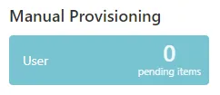
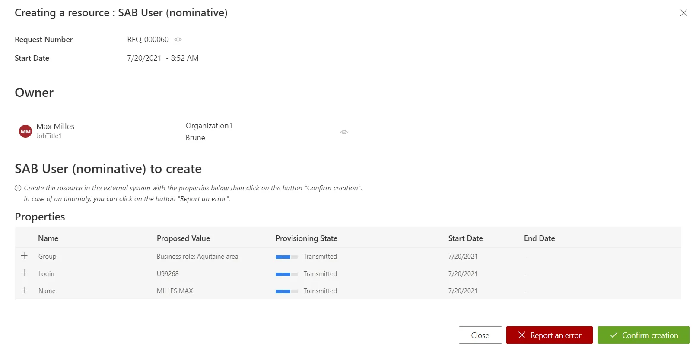
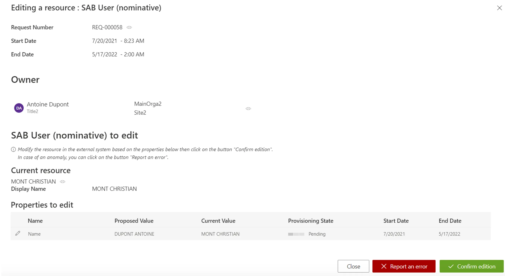

# Provision Manually

How to use Identity Manager to manually write to the managed systems.

## Overview

In the lifecycle of a resource (entitlement assignment, resource creation, resource update, etc.),
manual provisioning is used to make humans intervene and act on the external systems, instead of
Identity Manager.

### Provisioning states

In its lifecycle, an assignment request goes through the following provisioning states:

## Participants and Artifacts

This operation should be performed in cooperation with the staff in charge of managed systems as
write permissions are required.

| Input                                                                                                                                                                                 | Output                  |
| ------------------------------------------------------------------------------------------------------------------------------------------------------------------------------------- | ----------------------- |
| [ Review Provisioning ](../provisioning-review/index.md) (required) Manual provisioning [Create a Connection](../../../set-up/connect-system/connection-creation/index.md) (required) | Updated managed systems |

## Implement Manual Provisioning

Manual provisioning is performed through a connection using the
[ Manual Ticket ](../../../../integration-guide/connectors/references-packages/manual-ticket/index.md).
Besides, for a resource to be manually provisioned, the corresponding resource type must be
configured with the manual connection set to `Provisioning Connection` in the **Fulfill Settings**.

## Perform Manual Provisioning

Perform manual provisioning by proceeding as follows:

1. Ensure that the task to compute or generate provisioning orders was launched after the request
   (or the provisioning review, if any), through the complete job in the **Job Execution** page.

    

    

2. Access the manual provisioning orders page by clicking on the entity type that you want to manage
   in the **Manual Provisioning** section.

    

3. Choose a line to handle the corresponding provisioning order.
4. Creation, edition and deletion orders follow the same process: read Identity Manager's
   suggestions and create, edit or delete the appropriate resource directly in the managed system
   (outside Identity Manager).

    

    

5. Choose to confirm or report an error.

### Use bulk provisioning

Several orders can be provisioned simultaneously by clicking on **Bulk Provision**.

## Verify Manual Provisioning

In order to verify the process:

1. Select a test user in the directory, accessible from the home page.

    

2. Follow the [ Request Entitlement Assignment ](../../manual-assignment-request/index.md) to make a
   change in one of their permissions, which involves manual provisioning.
3. Perform manual provisioning and check the provisioning state of the requested entitlement at
   every step, in the user's **View Permissions** tab.

4. Check in your managed system that the change was effectively made.
