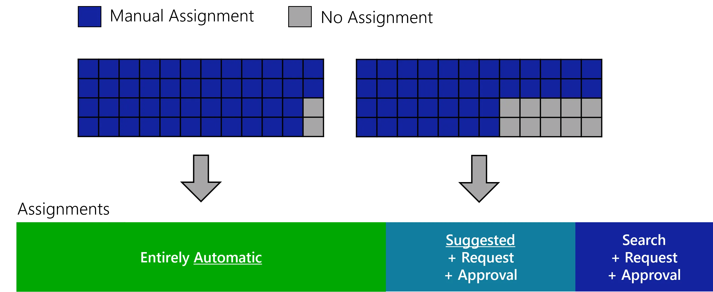
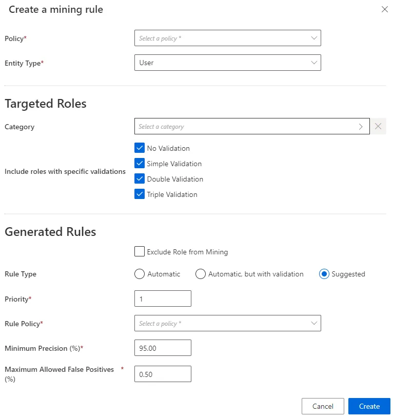

# Perform Role Mining

How to use role mining to suggest role assignment rules based on existing assignments, in order to
push the [ Automate Assignments ](../index.md) wall further.

## Overview

After the role catalog is established, the Compute Role Model Task task is able to assign single
roles to users according to their attributes which are used as assignment criteria.

> For example, in the AD, entitlements are given through group membership. Integrators create a
> navigation rule to assign each group to the users who have the corresponding single role. Then,
> the
> [ Compute Role Model Task ](../../../../integration-guide/toolkit/xml-configuration/jobs/tasks/server/computerolemodeltask/index.md)
> is able to assign single roles to users according to their existing group membership.
>
> In addition to group membership, the assignment of an entitlement to users could also depend on
> users' attributes like their location, position title, etc.

Now that users received their roles, the role mining tool can analyze these assignments and deduce
[Single Role Rule](../../../../integration-guide/toolkit/xml-configuration/provisioning/singlerolerule/index.md)
which will assign single roles to certain users matching given criteria.

Role mining is a Machine Learning process. It is a statistic tool used to emphasize the
[Single Role Rule](../../../../integration-guide/toolkit/xml-configuration/provisioning/singlerolerule/index.md)
that constitute the key criteria for existing role assignments. It detects the most probable links
between identities dimensions and their roles in order to suggest the appropriate entitlement
assignment rules.

> For example, suppose that 80% of NETWRIX workers in Marseilles have access to an application
> "App". Then, role mining is most likely to recognize the working site as a relevant dimension, and
> suggest to create a rule that gives the "App" access to users whose site is Marseilles.

Role mining being a statistic tool based on existing entitlement assignments, it appears useless if
the role model contains fewer than 2,000 role assignments. Then, start by reinforcing the Role
Catalog. See
the[ Create Roles in the Role Catalog ](../../../set-up/single-roles-catalog-creation/index.md)
topic for additional information.

### Technical Principles

Role mining works through
[ Mining Rule ](../../../../integration-guide/toolkit/xml-configuration/provisioning/miningrule/index.md)
that Identity Manager applies with the
[ Get Role Mining Task ](../../../../integration-guide/toolkit/xml-configuration/jobs/tasks/server/getroleminingtask/index.md).

### Entitlement differentiation with rule types

Mining rules can be configured to generate:

1. automatic rules, i.e. rules which assign roles automatically with or without a validation;
2. suggested rules, i.e. rules which don't assign roles directly, but suggest them during an
   entitlement request for a user.

    

You can generate both automatic and suggested rules for the same role, with different precision
levels and different approval workflows.

> Consider an organization where an unknown ratio of users have a given role. Using the precision
> settings, we can create a mining rule to generate automatic assignment rules when the ratio is
> above 95% and a second mining rule to generate suggested assignment rules when the ratio is
> between 75% and 95%.
>
> 

You can also differentiate entitlements according to their sensitivity, for example require
additional reviews following the request of a sensitive entitlement:

The automation of entitlement assignments according to sensitivity brings greater confidence in
basic entitlements assignment which won't need to be certified anymore. Thus, automation lets
certification campaigns focus on more sensitive entitlements.

Role mining should be performed first for automatic rules as they are stricter precision-wise. Thus,
automatic rules should always have priority over suggested rules (via the `Priority` setting).

See more details about role mining.

## Participants and Artifacts

At this point, integrators should have all the elements they need to operate.

| Input                   | Output            |
| ----------------------- | ----------------- |
| Role Catalog (required) | Single role rules |

See the[ Create Roles in the Role Catalog ](../../../set-up/single-roles-catalog-creation/index.md)
topic for additional information.

## Create a Mining Rule

Create a mining rule by proceeding as follows:

1. On the home page in the **Configuration** section, click on the **Role Mining** button.

    

    You will see all existing mining rules.

2. Click on the addition button at the top right and fill in the fields.

    

    

    - `Policy`: [Create a Policy](../../policy-creation/index.md) in which the mining rule exists.
    - `Entity Type`:
      [Create an Entity Type](../../../set-up/connect-system/entity-type-creation/index.md) on which
      the mining rule is applied, i.e. the entity type targeted by role mining's entitlement
      analysis.
    - `Category`:
      [ Create a Category ](../../../set-up/single-roles-catalog-creation/category-creation/index.md)
      containing the roles targeted by role mining's analysis.
    - `Include roles with specific validations`: includes in role mining's analysis the roles
      requiring zero and/or one and/or two and/or three validations.
    - `Exclude Role from Mining`: ignores the specified roles during the mining process triggered by
      the next mining rules (in terms of priority).
    - `Rule Policy`: [Create a Policy](../../policy-creation/index.md) in which the single role
      rules will be generated.

        Netwrix Identity Manager (formerly Usercube) recommends using a policy dedicated to role
        mining in order not to remove existing assignment rules.

    - `Rule Type`: type of the generated single role rules, which defines the type of role
      assignment that can be: `Suggested` so that the resource type is listed among suggested
      permissions in the permission basket of users matching the criteria during an entitlement
      request, suggested assignments must be selected manually to be requested; or `Automatic` so
      that the resource type is automatically assigned to users matching the criteria; or
      `Automatic but with validation` so that the resource type is listed in the permission basket
      of new workers, these assignments can still be modified.
    - `Priority`: priority order of the mining rule. Identity Manager applies mining rules one after
      the other in descending order.
    - `Minimum Precision`: minimum authorized percentage of correct role assignments, considering
      both the roles that are assigned to users who should have them, and the roles that are not
      assigned to users who should not have them.

        NETWRIX recommends around 99.5%, to be lowered when working on a sensitive application
        and/or a large user population, and vice versa.

    - `Maximum Allowed False Positives`: maximum authorized percentage of false positive
      assignments, i.e. roles that are assigned to users who should not have them.

        NETWRIX recommends around 1%, to be lowered when working on a sensitive application and/or a
        large user population, and vice versa.

    **Enlarge the number of managed entitlements by tolerating errors:**

    Automation reduces the error rate by avoiding human mistakes. Errors can still occur such as
    "[false positives](https://en.wikipedia.org/wiki/Binary_classification)", i.e. users receiving
    inappropriate entitlements, and thus creating security issues. However, experience shows that a
    slight error tolerance in role mining can highly benefit automation.

3. Click on **Create** and see a line added on the rules page.
4. Click on **Simulate** to perfom role mining in a simulation. See
   the[ Perform a Simulation ](../../simulation/index.md) topic for additional information.

    

    If you need to bypass the simulation process, clicking on **Launch** will perform role mining
    and apply its results directly. NETWRIX recommends always performing role mining in simulation.

## Impact of Modifications

Assignment rules can sometimes give to users an entitlement that they had already received manually.
Hence, new assignment rules can imply redundancies between the entitlements assigned manually and
approved, and those calculated by a rule and assigned automatically.

Netwrix Identity Manager (formerly Usercube) recommends
[Remove Redundant Assignments](../remove-redundant-assignments/index.md) after any assignment rule
is created or updated.

## Verify Role Mining

In order to verify the process, access the rule list from the home page.

Select **Single Roles** and check that the single role rules are created with the right parameters.
