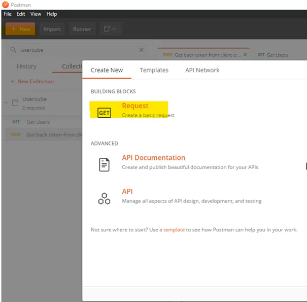
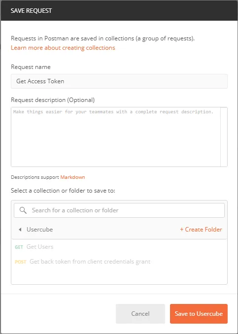
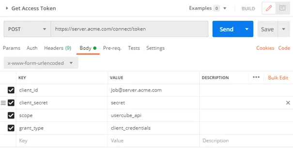
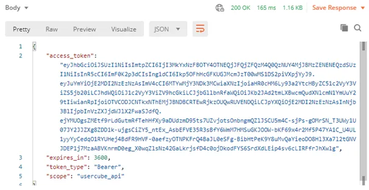
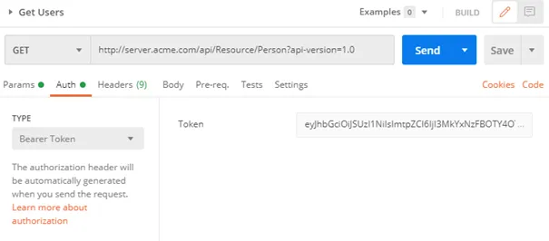
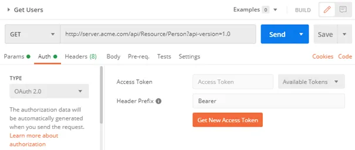
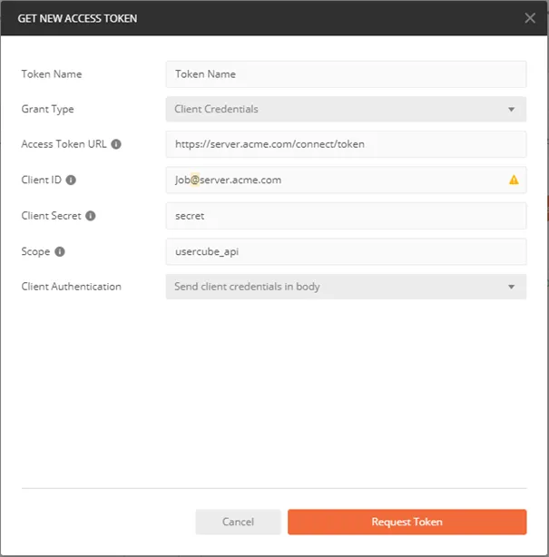

# Request APIs via Postman

This guide shows how to configure Postman to be able to request Identity Manager's API.

## Get an Access Token

Get an access token by proceeding as follows:

1. Launch Postman.
2. Create a new request by clicking on **+ New** then **Request**.

    

3. Fill in the fields and click on **Save to Identity Manager**.

    

4. Fill in the authentication information as follows:

    

    - **Method**: POST
    - **URL**: `URL IdentityManager`/connect/token
    - **Body**:
        - **client_id**: `OpenIdClient id`@`FQDN Usercube`
        - **client_secret**: `OpenIdClient secret`
        - **scope**: usercube_api
        - **grant_type**: client_credentials

5. Click on **Send** and get the access token from the response body.

    

## Use an Access Token

Use an access token by proceeding as follows:

1. Create a new request in Postman.
2. Fill in the authorization information as follows:

    

    - **Method**: GET
    - **URL**: `<URL IdentityManager>/<URI of the API to call>?api-version=1.0`
    - **Authorization**:
        - **TYPE**: Bearer Token
        - **Token**: `<Access Token>`

3. Click on **Send** and get the result from the response body.

    

## Create a Combined Request

Create a combined request by proceeding as follows:

1. Create a new request in Postman.
2. Fill in the authorization information as follows:

    

    - **Method**: GET
    - **URL**: `<URL IdentityManager>/<URI of the API to call>?api-version=1.0`
    - **Authorization**:
        - **TYPE**: OAuth 2.0
        - **Header Prefix**: Bearer

3. Click on **Get New Access Token** and fill in the fields as follows:

    

    - **Token Name**: `<Token Name>`
    - **Grant Type**: Client Credentials
    - **Access Token URL**: `<URL IdentityManager>/connect/token`
    - **Client ID**: `<OpenIdClient id>@<FQDN Usercube>`

        Do not replace `@` with its encoding.

    - **Client Secret**: `<OpenIdClient secret>`
    - **Scope**: usercube_api
    - **Client Authentication**: Send client credentials in body

4. Click on **Request Token** to get the token.

    

5. Click on **Use Token** and **Send** and get the result from the response body.

    
