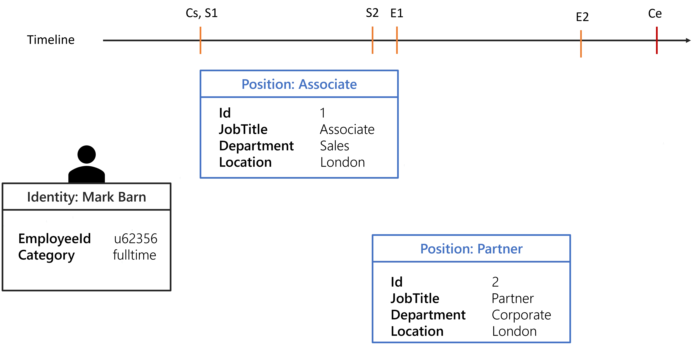
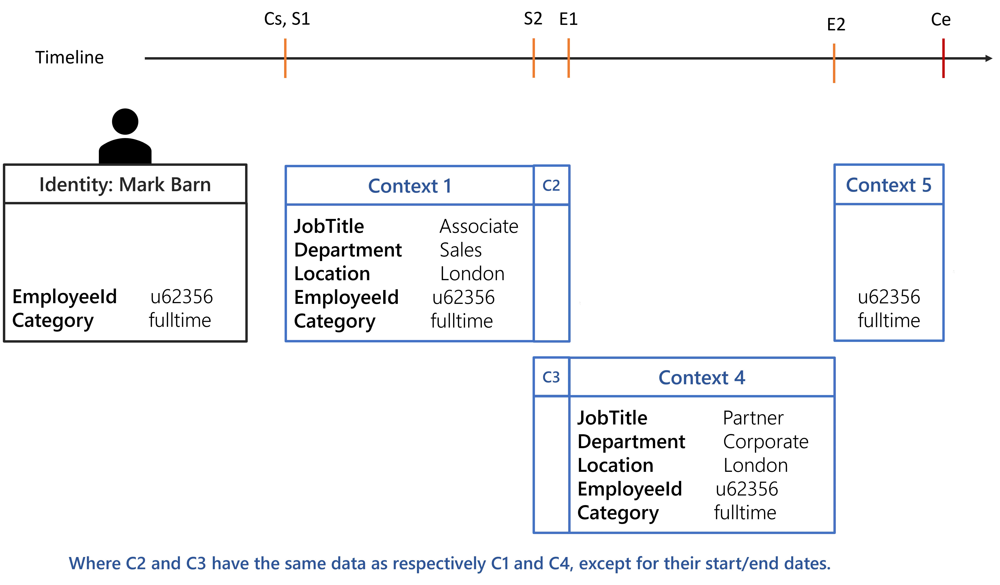

# Generate Contexts

A context is a set of dimension-value pairs computed using the
[ Context Rule ](../../toolkit/xml-configuration/provisioning/contextrule/index.md) or the
combination of a context rule and the
[ Record Section ](../../toolkit/xml-configuration/provisioning/recordsection/index.md) if record
sections are configured.

A context is used to compute the role assignments for an identity by verifying that the
dimension-value pairs meet the role criteria.

## Basic Context Generation

When using only a context rule without a record section, the context generation is straightforward:
a set of dimension-value pairs is created by computing the value of the
[ Context Rule ](../../toolkit/xml-configuration/provisioning/contextrule/index.md) on the context
rule.

> For example, the following context rule defines guests' contexts based on their start date, end
> date, and company.
>
> ```
>
> <ContextRule Identifier="ContextRuleForGuest" DisplayName_L1="ContextRuleForGuest" Policy="Default" ResourcesStartBinding="Directory_Guest:StartDate" ResourcesEndBinding="Directory_Guest:EndDate" SourceEntityType="Directory_Guest" BA="Directory_Guest:Company" />
>
> ```

## Identity Context Generation

As described in the [Identity Management](../../identity-management/index.md), identities are
complex to model. Records were introduced to tackle this complexity by allowing multiple positions
for the same identity.

[ Record Section ](../../toolkit/xml-configuration/provisioning/recordsection/index.md) go further
by modeling the relationship between positions. Indeed with record sections, it is possible to
define:

- what are the shared properties between all positions?
- what are the properties unique to each position?
- what happens when there is a time gap between two positions, should the previous be extended or
  should the future position be used to fill the gap?
- what happens when a position property value is not defined?

Before illustrating how the record sections can be configured to handle most cases of position
management, here is the background situation for the examples that follow:

- A position is defined by a `JobTitle`, a `Location`, and a `Department`, all other properties
  belong to the identity and are shared between all positions.
- Dimensions are `Category`, `JobTitle`, `Location`, and `Department`.
- Each position will have an `Id`.
- `Sx` represents the start date of the position, and x is the `Id` of the position.
- `Ex` represents the end date of the position, and x is the `Id` of the position.
- `Cs` represents the contract start date.
- `Ce` represents the contract end date.

The following configuration shows the context rule that will be used for the examples.

```

<ContextRule Identifier="ContextRuleUserToRecord" DisplayName_L1="ContextRuleUserToRecord" Policy="Default" ResourcesBinding="Records" ResourcesStartBinding="StartDate" ResourcesEndBinding="EndDate" B0="Directory_UserRecord:Department" B1="Directory_UserRecord:JobTitle" B2="Directory_UserRecord:Location" B3="Directory_UserRecord.Category" SourceEntityType="Directory_User" />

```

The context rule start/end dates bindings and expressions won't have any effect on the computation,
they are overridden by the record sections dates properties.

### Configuration of basic record sections

```

Default section:
<RecordSection Identifier="Directory_UserRecord_Default" DisplayName_L1="Contract Properties" SourceEntityType="Directory_User" ResourceEntityType="Directory_UserRecord" StartProperty="ContractStartDate" EndProperty="ContractEndDate">
</RecordSection>

Position record section:
<RecordSection Identifier="Directory_UserRecord_Position" DisplayName_L1="Position Properties" SourceEntityType="Directory_User" ResourceEntityType="Directory_UserRecord" StartProperty="StartDate" EndProperty="EndDate">    <Property Property="Department" ExtensionKind="None" />    <Property Property="Location" ExtensionKind="None" />    <Property Property="JobTitle" ExtensionKind="None" /></RecordSection>

```

The configuration above binds the position to the contract end date, meaning that a position without
an end date will take the end date of the contract. The properties of the position record section
cannot be propagated, meaning if a position does not have a `Location` it cannot take the `Location`
of the previous or future position.

The following image shows the positions of `Mark Barn` in a defined timeline.



With the given configuration and the identity of `Mark Barn`, the following contexts are generated:



Each computed context will be used to create a set of dimension-value pairs, thus having 3 sets for
the [Evaluate Policy](../evaluate-policy/index.md) algorithm.

Any rules targeting identities with a `fulltime`Category`will be assigned to`Mark
Barn`from`Cs`to`Ce```.

Any rules targeting identities working in `London` will be assigned to `Mark Barn` from `S1` to
`E2`.

Any rules targeting all identities will be assigned to `Mark Barn` from `Cs` to `E2` because from
`E2` to `Ce` there isn't any position. This behavior can be overridden by specifying
`ExtensionKind="None"` on the `Directory_UserRecord_Position` section.

### Configuration of a position extension

#### Extension of a property

The record sections can help extend some position property value when for some time the identity
does not have a position. For example, let's say that an identity can have multiple positions but
they must be in the same `Location`. So it is safe to configure the record sections to copy the
`Location` from a position if:

- the identity does not have a position for some time;
- for a position, the `Location` is not defined.

Here is the configuration needed to apply this policy.

```

Default section:
<RecordSection Identifier="Directory_UserRecord_Default" DisplayName_L1="Contract Properties" SourceEntityType="Directory_User" ResourceEntityType="Directory_UserRecord" StartProperty="ContractStartDate" EndProperty="ContractEndDate">
</RecordSection>

Position record section:
<RecordSection Identifier="Directory_UserRecord_Position" DisplayName_L1="Position Properties" SourceEntityType="Directory_User" ResourceEntityType="Directory_UserRecord" StartProperty="StartDate" EndProperty="EndDate">    <Property Property="Department" ExtensionKind="None" />
    <Property Property="Location" />
    <Property Property="JobTitle" ExtensionKind="None" /></RecordSection>

```

The `ExtensionKind="None"` was removed for the `Location` property.

Using the identity of `Mark Barn` the computed contexts should be as followed:


Any rules targeting identities working in `London` will be assigned to `Mark Barn` from `Cs` to
`Ce`.

#### Extension of a whole position

The [property value copy](#extension-of-a-property) can be leveraged to extend a chosen position
when for some time the identity does not have one. The following configuration and the identity of
`Phoebe Buffay` will be used to showcase a position extension. It is done by removing the
`ExtensionKind="None"` of the position properties.

```

Default section:
<RecordSection Identifier="Directory_UserRecord_Default" DisplayName_L1="Contract Properties" SourceEntityType="Directory_User" ResourceEntityType="Directory_UserRecord" StartProperty="ContractStartDate" EndProperty="ContractEndDate">
</RecordSection>

Position record section:
<RecordSection Identifier="Directory_UserRecord_Position" DisplayName_L1="Position Properties" SourceEntityType="Directory_User" ResourceEntityType="Directory_UserRecord" StartProperty="StartDate" EndProperty="EndDate">
    <Property Property="Department" />    <Property Property="Location" />    <Property Property="JobTitle" />
</RecordSection>

```


Two contexts will be generated.


By default, the previous position is extended when there is a gap. If there isn't any previous
position then the next position will be anticipated.

The choice of the position to extend can be configured by leveraging the `SortKeyExpression` in the
position [ Record Section ](../../toolkit/xml-configuration/provisioning/recordsection/index.md).
