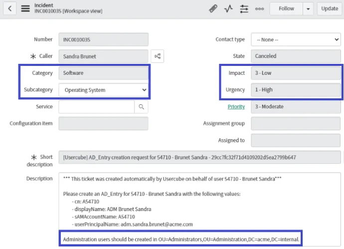

# Service Now Resource Type Mapping

Any resource type mapping must be configured with the same identifier as the related resource type.

Any resource type linked to a ServiceNow connection must be configured with a set of parameters to
map the properties in Identity Manager with those in ServiceNow, for provisioning purposes.

Below is an example of an incident ticket in ServiceNow, where relevant properties (from Identity
Manager's perspective) are emphasized:



## Examples

Code attributes enclosed with `<>` need to be replaced with a custom value before entering the
script in the command line.

```
<ServiceNowResourceTypeMapping Identifier="ServiceNow_Entry_NominativeUser" Connection="ServiceNowExportFulfillment" PasswordResetSetting="ToSelf" DefaultObjectClass="sys_user">
  <Property Property="sys_id" IsDNProperty="true" />
</ServiceNowResourceTypeMapping>
```

## Properties

| Property                                         | Type          | Description                                                                                                                                                                                                                                                                                                                                                                               |
| ------------------------------------------------ | ------------- | ----------------------------------------------------------------------------------------------------------------------------------------------------------------------------------------------------------------------------------------------------------------------------------------------------------------------------------------------------------------------------------------- |
| Connection required                              | String        | Identifier of the corresponding connection.                                                                                                                                                                                                                                                                                                                                               |
| DefaultObjectClass optional                      | String        | Default object class used by the provisioner, for example person, organizationalPerson, and user, etc. Multiple default object classes are separated with <br/>.                                                                                                                                                                                                                          |
| PasswordResetSetting optional                    | String        | Identifier of the corresponding password reset setting.                                                                                                                                                                                                                                                                                                                                   |
| TicketAdditionalInformation optional             | String        | Information to add at the end of the description for all tickets created for this resource type. Only used with the package for tickets. See the [ ServiceNow Ticket ](../../../../../connectors/references-packages/servicenow-ticket/index.md) topic for additional information.                                                                                                        |
| TicketCallerId optional                          | String        | Attribute that corresponds to the identifier of the "caller" person in ServiceNow. Required when using the package for tickets. See the [ ServiceNow Ticket ](../../../../../connectors/references-packages/servicenow-ticket/index.md) topic for additional information.                                                                                                                 |
| TicketCategory optional                          | String        | Category in which new tickets will be created in ServiceNow for this resource type. **NOTE:** Only used with the package for tickets. See the [ ServiceNow Ticket ](../../../../../connectors/references-packages/servicenow-ticket/index.md) topic for additional information.                                                                                                           |
| TicketImpact default value: Low                  | TicketImpact  | Impact of the ticket in ServiceNow: Low; Medium; or High. Only used with the package for tickets. See the [ ServiceNow Ticket ](../../../../../connectors/references-packages/servicenow-ticket/index.md) topic for additional information.                                                                                                                                               |
| TicketSubCategory optional                       | String        | Subcategory in which new tickets will be created in ServiceNow for this resource type. Only used with the package for tickets. See the [ ServiceNow Ticket ](../../../../../connectors/references-packages/servicenow-ticket/index.md) topic for additional information.                                                                                                                  |
| TicketSynchroIsNotAvailable default value: false | Boolean       | True to set synchronization as unavailable for this resource type. Once the ticket is closed and the resource is created, updated or deleted, then the assignment's status is directly set to Verified. Only used with the package for tickets. See the [ ServiceNow Ticket ](../../../../../connectors/references-packages/servicenow-ticket/index.md) topic for additional information. |
| TicketUrgency default value: Low                 | TicketUrgency | Urgency of the ticket in ServiceNow: Low; Medium; High. **NOTE:** Only used with the package for tickets. See the [ ServiceNow Ticket ](../../../../../connectors/references-packages/servicenow-ticket/index.md) topic for additional information.                                                                                                                                       |
