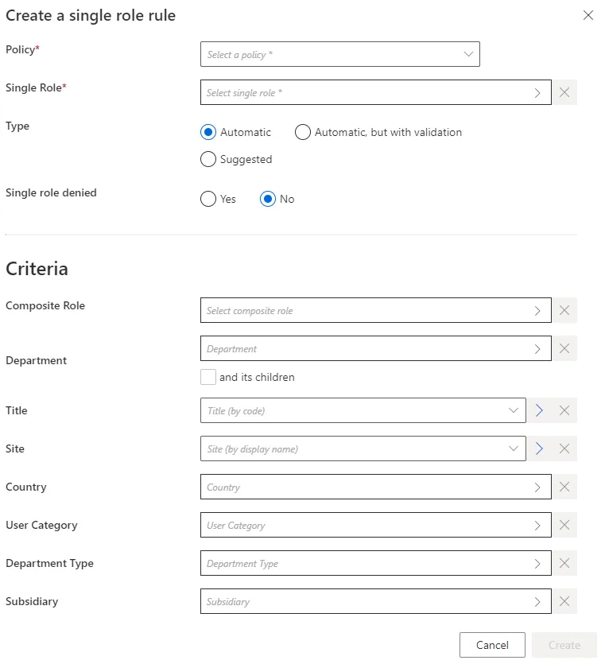

# Automate Role Assignments

How to manually build rules to automate the assignment of roles to identities. See the[
Create Roles in the Role Catalog
](../../../set-up/single-roles-catalog-creation/index.md) topic for additional information.

## Overview

Single role rules and composite role rules are assignment rules. Assignment rules are designed to automatically assign respectively single roles and composite roles (based on specific criteria) to identities. One rule must be created for every role to assign. See the[
Create Roles in the Role Catalog
](../../../set-up/single-roles-catalog-creation/index.md) topic for additional information.

## Participants and Artifacts

For a given managed system, integrators may need the help of the application owner who knows the application's users, entitlements and data model.

| Input | Output |
| --- | --- |
| Role Catalog (required) | Role assignment rules |

See the[
Create Roles in the Role Catalog
](../../../set-up/single-roles-catalog-creation/index.md) topic for additional information.

## Create a Role Assignment Rule

Create a role assignment rule by proceeding as follows:

1. Access the rules page by clicking on __Access Rules__ on the home page in the __Configuration__ section.

   
2. In the dropdown menu at the top left, choose the source entity type for the future scalar rule.

   
3. Click on the __Composite Roles__ or __Single Roles__ tab and on the addition button at the top right corner.

   
4. Fill in the fields.

   

   - ```Single Role```: single role to be automatically assigned in a single role rule. ```Composite Role``` for a composite role rule.
   - ```Type```: assignment type that can be: ```Suggested``` so that the role is listed among suggested permissions in the permission basket of users matching the criteria during an entitlement request, suggested assignments must be selected manually to be requested; or ```Automatic``` so that the role is automatically assigned to users matching the criteria; or ```Automatic but with validation``` so that the role is listed in the permission basket of new workers, these assignments can still be modified.

     The rule's type can be ```Suggested``` only if the related role is allowed to be requested manually.
   - ```Single role denied```: option that forbids the assignment instead of applying it.
   - __Criteria__: conditions that, if met, trigger the single role automatic assignment.

   Role assignment rules can be based on identity dimensions. Moreover, single role rules can be based on composite roles.
5. Click on __Create__ and see a line added on the rules page.

## Impact of Modifications

Any modification in a role assignment rule is taken into account when the next [
Compute Role Model Task
](../../../../integration-guide/toolkit/xml-configuration/jobs/tasks/server/computerolemodeltask/index.md) runs to compute new assignments. Therefore, if a given rule's criterion is modified, then all corresponding assignments are computed again. If a role was assigned automatically to an identity by a role assignment rule, and if this assignment doesn't comply with the new version of the rule, then the corresponding role is automatically removed.

A modification in a role assignment rule can trigger the removal of a role only on the Identity Manager side. There are several barriers to cross before said role is removed from the managed system.

> For example, consider a single role rule that assigns the single role ```Business role: electronic banking``` to all users in the ```Tours``` department. Let's say that we replace ```Tours``` with ```Orleans```. Then, after the next launch of the complete job, all users in the ```Orleans``` department get said role, while the users in the ```Tours``` department are deprived of said role.

[
Perform a Simulation
](../../simulation/index.md) is available in order to anticipate the changes induced by a creation/modification/deletion in role assignment rules.

Assignment rules can sometimes give to users an entitlement that they had already received manually. Hence, new assignment rules can imply redundancies between the entitlements assigned manually and approved, and those calculated by a rule and assigned automatically.

Netwrix Identity Manager (formerly Usercube) recommends removing redundant assignments after any assignment rule is created or updated.

## Verify Rule Creation

In order to verify the process, start by checking the rule's details on the __Access Rules__ page. Then, you can:

1. Select a test user in the directory, accessible from the home page.

   
2. Create a role assignment rule for a role that said user doesn't already have, and based on criteria which the selected user satisfies.
3. Trigger the computation of the role model through the complete job on the __Job Execution__ page in the __Administration__ section.

   
4. See the new permission in the user's __View Permissions__ tab.

   
