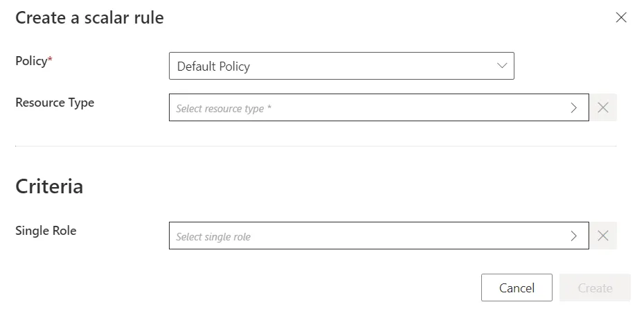
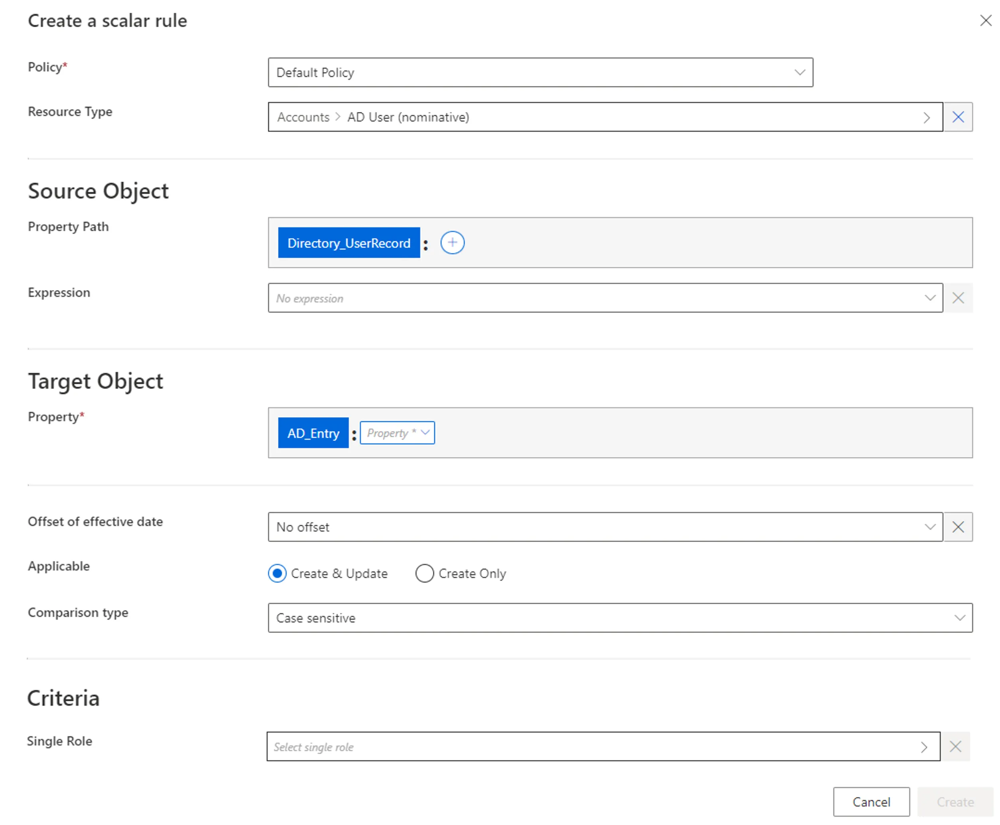
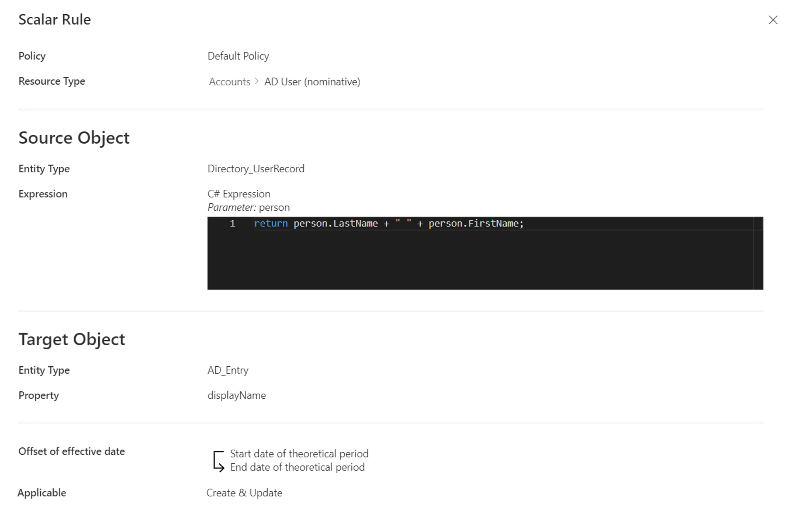

# Compute a Scalar Property

How to define scalar rules to compute and provision the values of scalar properties for target
resources based on source resources. See the
[Resource Type](../../../../integration-guide/toolkit/xml-configuration/provisioning/resourcetype/index.md) topic
for additional information.

## Overview

Sources are usually identities, and targets are usually accounts from the managed systems.

Here, we are going to compute the values of scalar properties for the target resources used in
entitlement management, based on source resources. See the
[Create an Entity Type](../../connect-system/entity-type-creation/index.md) topic for additional
information. We are going to provision these properties, i.e. write them to the managed system. See
the [Provision](../../../administrate/provisioning/index.md)topic for additional information.

The right tools for the job are scalar rules.

A scalar property's value can be computed by a scalar rule, based on at least one scalar property
from the source entity type, possibly writing a C# expression.

A scalar rule could define the scalar property displayName of nominative AD accounts based on its
owner's name with the expression:

return person.LastName + " " + person.FirstName;

The application of a scalar rule can depend on the assignment of a single role. See the
[ Create Roles in the Role Catalog ](../../single-roles-catalog-creation/index.md) topic for
additional information.

Sometimes we create in Identity Manager properties which are not directly linked to any real
property in the managed system. A scalar rule on this kind of property will not find a property to
provision in the managed system, and thus will not produce any result.

For example, we may need to create in the AD the property isUnused (to spot unused accounts) with a
C# expression based on other properties from the same entity type. These properties, such as
accountExpires and lastLogonTimestamp, are each linked to a property from the AD, while isUnused is
for Identity Manager's use only. This scalar property isUnused does not exist in the AD, thus will
never be provisioned to the AD, and thus will not be computed by a scalar rule.

Also some properties, like lastLogonTimestamp in the AD or identifiers from ServiceNow, must be
changed only by their application. Identity Manager can/must not change these properties, thus no
provisioning rule is appropriate for them.

A scalar rule using a single role as criterion will trigger the creation of a target resource for
all impacted source resources (so all users), which are not yet correlated with a resource of this
resource type.

Without a criterion, a scalar rule does not create resources, and only computes the scalar
properties of existing resources.

## Guidelines

Expression code must not contain too much data

Once configured, a rule is a complicated object to modify. Therefore, you must keep business data in
the resource and out of the expression. It is easier to change data than to change a rule.

For example, consider an organization that manages email addresses according to the site with .fr
for France and .be for Belgium.

A working option could be to write an expression with a condition if on the site to assign the
domain name. However, if the organization expands and needs to consider an additional country, then
the rule requires change in the expression code.

A better solution is to change the identity data model by adding a field Domain Name to describe the
object Site, and to be used in the rule expression. In this case, if there is an additional country,
then a new field is added in the data model for Site and Domain Name. Thus, the rule expression
remains simple by using the new objects, for example
`Email = FirstName + "." + LastName + "@" + Company + "." + DomainName`.

Priority between scalar rules

A scalar rule with a role as a criterion has a higher priority than a rule without a role criterion.

For example, consider the situation where we want the login `A` for users with the single role `RA`,
and the login `B` for the others. In this case, we can write two distinct scalar rules where the
first one has the role `RA` as a criterion. This rule will be applied before the other.

Other than that, there should not be more than one rule meant to provision a given property on a
given time period.

It means that:

- Several rules computing the same property with different criteria should not coexist;
- The only reason to have several rules to compute a single property is when changing the property
  value over time, via time offsets.

## Participants and Artifacts

For a given managed system, integrators may need the help of the application owner who knows the
application users, entitlements and data model.

| Input                     | Output       |
| ------------------------- | ------------ |
| Categorization (required) | Scalar rules |

See the [ Categorize Resources ](../../categorization/index.md) topic for additional information.

## Create a Scalar Rule

Fill an entity type with a scalar rule by proceeding as follows:

**Step 1 –** Click on **Access Rules** on the home page in the **Configuration** section.

**Step 2 –** In the dropdown menu at the top left, choose the source entity type for the future
scalar rule.

**Step 3 –** Click on the **Scalars** tab and on the addition button at the top right corner.

**Step 4 –** Fill in the fields.

Once the Resource Type is provided, more fields appear.

- Source Object: Scalar property (or expression of scalar properties) from the source entity type,
  which constitutes the input for the computation of the target object. Can be defined by a property
  path and/or an expression.
- Target Object: Scalar property from the target entity type, whose value is to be impacted.
- Offset of effective date: Time period that defines the actual effective date for property
  computation according to the value's start and/or end date.

    For example, account activation and deactivation can be managed according to the start and/or
    end dates.

- Applicable: Create & Update to use this computation to both provision the managed system and
  synchronize the property back to Identity Manager; **Create Only** to use this computation to only
  provision the managed system and ignore this property during synchronization, this way the
  property can never be displayed as non-conforming.

    **Create Only** is usually set to adapt the configuration to the constraints of the managed
    system, when Identity Manager does not retrieve and/or update the property value.

    For example, consider a system, that we want to connect to Identity Manager (let's call it SYST)
    using a title property. Consider also that SYST needs to be provisioned with the value of title,
    but does not allow any other system to retrieve said value.

    In this case, we use **Create Only** so that Identity Manager sends the adequate provisioning
    order upon creation, and then is able to change the provisioning state to **Executed** without
    synchronization. If any changes impact that **Scalar Property** value the workflow state will be
    modified to **PolicyApprovedWithChanges** meaning that the policy value is not equal to the
    external system's value and that will not be provisioned.

- Comparison type: Comparison type between the value of the target object computed by the rule and
  its value from the managed system. Non-conforming values are displayed on the **Provisioning
  Review** screen.
- Criteria: Conditions that, if met, trigger the rule application.

Our example would look like:

**Step 5 –** Click on **Create** and see a line added on the rules page.

## Impact of Modifications

Any modification in a scalar rule is taken into account when launching the role model computation
task, in the **Resource Types** frame of the corresponding connector's overview page, via **Jobs** >
**Compute Role Model**.

This task applies the rules and computes new properties. Therefore, if a given rule's criterion is
modified, then all corresponding assignments are computed again. If a resource was created
automatically for an identity through a scalar rule (and its single role criterion), and if the
user's criteria do not comply with the new version of the rule, then the corresponding resource is
automatically deleted.

A modification in a provisioning rule can trigger the removal of a resource only on the Identity
Manager side. There are several barriers to cross before said resource is removed from the managed
system.

Simulations are available in order to anticipate the changes induced by a
creation/modification/deletion in scalar rules. See the
[ Perform a Simulation ](../../../optimize/simulation/index.md) topic for additional information.

## Verify Rule Creation

In order to verify the process:

**Step 1 –** On the corresponding connector's overview page, in the **Resource Types** frame click
on **Jobs** > **Compute Role Model** to apply all rules.

**Step 2 –** Review unreconciled properties on the **Resource Reconciliation** screen to help check
scalar rules: if there are numerous properties to be reconciled following the same pattern, then
there may be a rule that needs to be changed. See the
[ Reconcile a Property ](../../../administrate/non-conforming-assignment-review/property-reconciliation/index.md)
topic for additional information.

Once the steps completed the process is verified.
