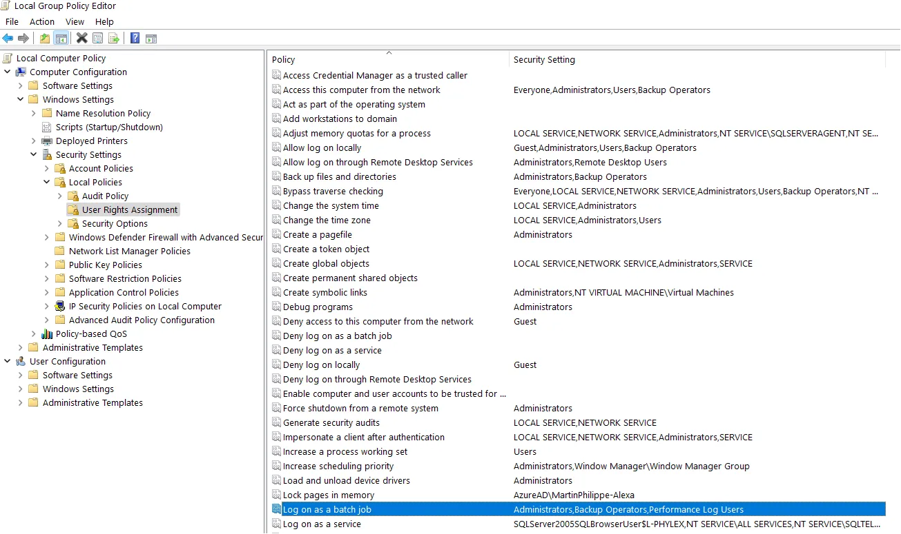

# SharedFolders

This connector exports users and permissions from Windows shared folders.

This page is about [
Shared Folders
](../../references-packages/shared-folders/index.md).


## Overview

Also known as UFA (Identity Manager Folder Access), this connector can be used to scan the access rights assigned to folders and files in computers and networks which comply with the [Windows File Security and Access Rights systems](https://docs.microsoft.com/en-us/windows/win32/fileio/file-security-and-access-rights).

## Prerequisites

Implementing this connector requires an account with the permissions:

- to access all relevant folders and files and read their entitlements;
- __Log on as a batch job__ in the local group policy, when the connector's authentication mode is batch.

  

## Export

This connector scans shared folders in order to export their content to CSV files.

### Configuration

This process is configured through a [
Connection
](../../../toolkit/xml-configuration/connectors/connection/index.md) in the UI and/or the XML configuration, and in the ```appsettings.agent.json > Connections``` section:

```
appsettings.agent.json
{
  ...
  "Connections": {
    ...
    "<ConnectionIdentifier>": {
      ...
    }
  }
}
```

The identifier of the connection and thus the name of the subsection must:
  
- be unique.
  
- not begin with a digit.
  
- not contain ```<```, ```>```, ```:```, ```"```, ```/```, ```\```, ```|```, ```?```, ```*``` and ```_```.

> The following example reads ```12``` levels of folders in the folders ```R&D_Projects``` and ```Management``` in the network ```OfficeNetwork``` and in ```C:/```. We only read entitlements about folders and we don't have access rights to the entitlements associated with the SIDs ```S-1-3-2-4``` and ```S-5-7-6-8```. We use the service account [account@example.com](mailto:account@example.com) with its related password and domain, and interactive connection:
>
> ```
> appsettings.agent.json
> {
>   ...
>   "Connections": {
>     ...
>     "SharedFolderExport": {
>         "InputDirectories": [ "OfficeNetwork/R&D_Projects", "OfficeNetwork/Management", "C:/" ],
>         "OnlyDirectoryScan": "true",
>         "LevelOfScan": "12",
>         "ListOfSIDToAvoid": [ "S-1-3-2-4", "S-5-7-6-8" ],
>         "Login": "account@example.com",
>         "Password": "accountexamplepassword",
>         "Domain": "Example",
>         "Interactive": true
>     }
>   }
> }
> ```

#### Setting attributes

| Name | Details |
| --- | --- |
| InputDirectories   required | __Type__    String List   __Description__ Paths of the folders to be scanned. |
| Domain   optional | __Type__    String   __Description__ Domain of the account used to access files and read their access rights. |
| Interactive   default value: False | __Type__    Boolean   __Description__ ```True``` to set authentication as interactive, ```False``` to set it as batch. |
| LevelOfScan   optional | __Type__    Int32   __Description__ Number of file and folder levels to be scanned. By default, it scans the whole folder tree for each input directory. |
| ListOfSIDToAvoid   optional | __Type__    String List   __Description__ SIDs (users or groups) to exclude from the scan. |
| OnlyDirectoryScan   default value: False | __Type__    Boolean   __Description__ ```True``` to scan only folders' entitlements and not files', ```False``` to scan all. |
|  |  |
| --- | --- |
| Login   optional | __Type__    String   __Description__ Login of the account used to access the files and folders.   __Note:__ when not specified and ```Password``` neither, then the account running Identity Manager will be used.   __Note:__ if ```Domain``` is null, then ```Login``` must be set in the User Principal Name (UPN) format. |
| Password   optional | __Type__    String   __Description__ Password of the account used to access the files and folders.   __Note:__ when not specified and ```Login``` neither, then the account running Identity Manager will be used. |

### Output details

This connector is meant to generate to the [Application Settings](../../../network-configuration/agent-configuration/appsettings/index.md)Export Output folder the following CSV files:

- ```<connectionIdentifier>_ACE.csv```, with the following columns:
  - __key__: concatenation of ```Right```, ```Path``` and ```OwnerSID```;
  - __Path__: path of the folder or file;
  - __Right__: entitlement among the following, listed from weakest to strongest:  
    ListDirectory / ReadData / CreateFiles / WriteData / AppendData / CreateDirectories / ReadExtendedAttributes / WriteExtendedAttributes / ExecuteFile / Traverse / DeleteSubdirectoriesAndFiles / ReadAttributes / WriteAttributes / Write / Delete / ReadPermissions / Read / ReadAndExecute / Modify / ChangePermissions / TakeOwnership / Synchronize / FullControl
  - __AllowOrDeny__: ```0``` (or ```false```) if the entitlement is allowed, ```1``` (or ```true```) if it is denied;
  - __OwnerSID__: SID of the entitlement's owner.
- ```<connectionIdentifier>_PathInformations.csv```, with the following columns:
  - __Path__;
  - __ParentPath__: path of the file's or folder's parent folder;
  - __BlockInheritance__: ```true``` if the file or folder blocks entitlement inheritance in the tree;
  - __Hierarchy__: hierarchy in the scanned tree.
- ```<connectionIdentifier>_SID.csv```, with only one column __SID__.

## Fulfill

There are no fulfill capabilities for this connector.

## Authentication

### Password reset

This connector does not reset passwords.

### Credential protection

Data protection can be ensured through:

- [
  Connection
  ](../../../toolkit/xml-configuration/connectors/connection/index.md), configured in the ```appsettings.encrypted.agent.json``` file;
- An [
  Connection
  ](../../../toolkit/xml-configuration/connectors/connection/index.md) safe;

| Attribute | Naming Convention for the Key in Azure Key Vault |
| --- | --- |
| Domain | ```Connections--<identifier>--Domain``` |
| Interactive | ```Connections--<identifier>--Interactive``` |
| LevelOfScan | ```Connections--<identifier>--MembersFile``` |
| ListOfSIDToAvoid | ```Connections--<identifier>--ListOfSIDToAvoid``` |
| Login | ```Connections--<identifier>--Login``` |
| OnlyDirectoryScan | ```Connections--<identifier>--OnlyDirectoryScan``` |
| Password | ```Connections--<identifier>--Password``` |
| InputDirectories | ```Connections--<identifier>--InputDirectories``` |

- A [
  Connection
  ](../../../toolkit/xml-configuration/connectors/connection/index.md) able to store Active Directory's ```Login``` and ```Password```.

Protected attributes are stored inside a safe in CyberArk, into an account whose identifier can be retrieved by Identity Manager from ```appsettings.cyberark.agent.json```.

> For example:
>
> ```
> appsettings.cyberark.agent.json
> {
>   ...
>   "Connections": {
>     ...
>     "SharedFolderExport": {
>         "Login": "SharedFolderSettings",
>         "Password": "SharedFolderSettings"
>     }
>   }
> }
> ```
