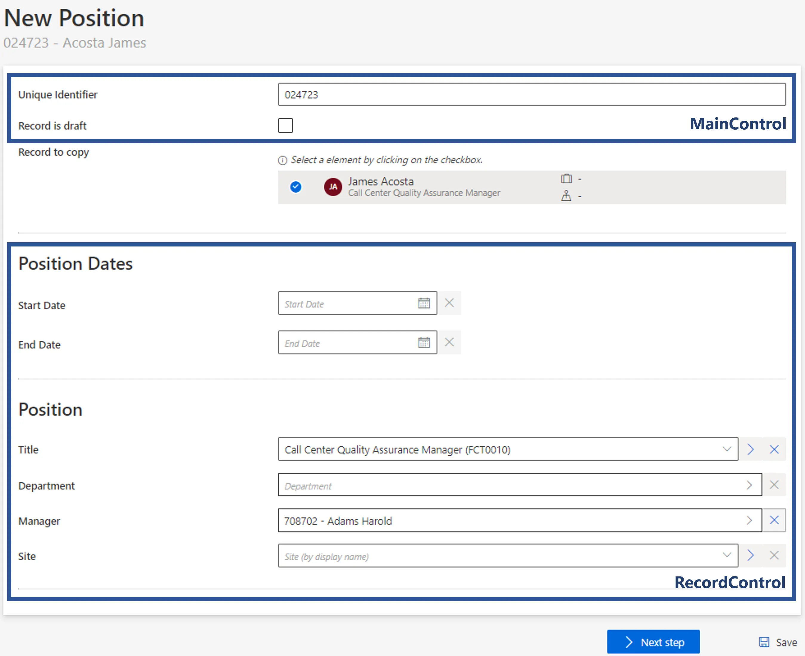
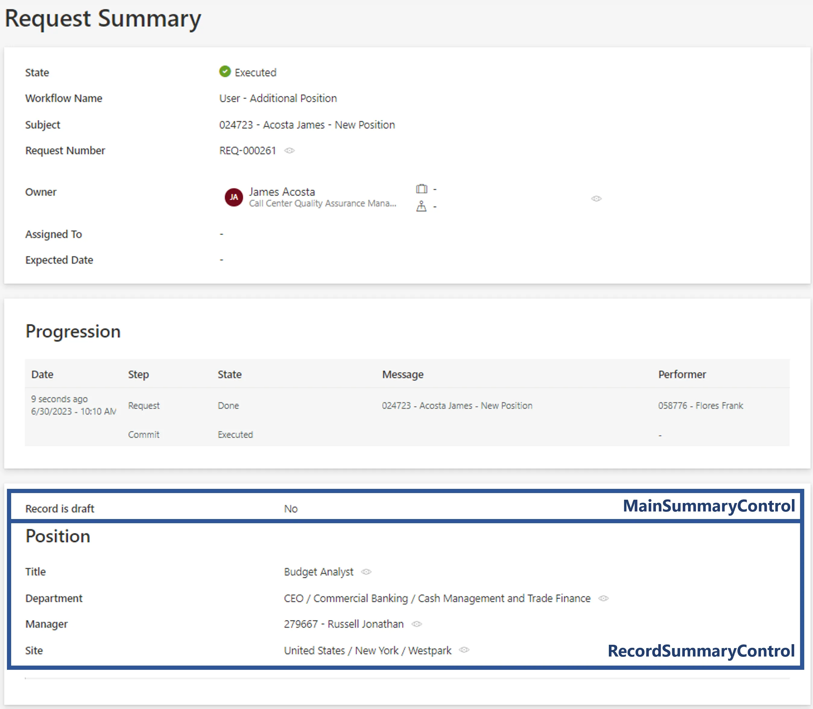

# WorkflowAddRecordEntityForm

Displays a form to add a new record for an existing resource, by duplicating and adjusting an
existing record.

## Examples

The following example is a form to request a computer.

Code attributes enclosed with `<>` need to be replaced with a custom value before entering the
script in the command line.

```

<WorkflowAddRecordEntityForm Identifier="Workflow_Directory_User_AddPosition" EntityType="Workflow_Directory_User" MainProperty="Workflow_Directory_User:Directory_User" RecordProperty="Directory_User:Records" WorkflowRequestType="Self" Activity="Directory_User_AddPosition:Request" FormTitle_L1="New Position" >
    <MainControl OutputType="TransformImport" EmbeddedForm="Workflow_Directory_User_Main"/>
    <RecordControl OutputType="TransformImport" EmbeddedForm="Workflow_Directory_User_AddPosition_Base" />
    <RecordUniqueItemControl OutputType="TransformImport" EmbeddedForm="Workflow_Directory_User_AddPosition_Unique" />
    <MainSummaryControl OutputType="TransformImport" EmbeddedForm="Workflow_Directory_User_Main" />
    <RecordSummaryControl OutputType="TransformImport" EmbeddedForm="Workflow_Directory_User_AddPosition_Base" />
</WorkflowAddRecordEntityForm>
With the following form for the resource data's content and summary:
<Form Identifier="Workflow_Directory_User_Main" EntityType="Directory_User">
    <Control Binding="Identifier" />
    <Control Binding="IsDraft" />
</Form>
And with the following form for the record data's content and summary:
<Form Identifier="Workflow_Directory_User_AddPosition_Base" EntityType="Directory_UserRecord">
    <Control DisplayName_L1="Position Dates" OutputType="LayoutFieldset">
        <Control Binding="StartDate" />
        <Control Binding="EndDate" InputType="Date" />
    </Control>
    <Control DisplayName_L1="Position" OutputType="LayoutFieldset">
        <Control Binding="Title" />
        <Control Binding="Organization" />
        <Control Binding="Manager" DefaultValueBinding="Organization.Manager" />
        <Control Binding="Site" DefaultValueBinding="Organization.Manager.MainRecord.Site" />
    </Control>
</Form>
And with the following form for the data that groups records together:
<Form Identifier="Workflow_Directory_User_AddPosition_Unique" EntityType="Directory_UserRecord">
    <Control Binding="PositionIdentifier" />
</Form>

```

The contents of `MainControl` and `RecordControl` are visible during the workflow's execution:



The content of `RecordUniqueItemControl` is not visible. The user's records that have the same
values for all the properties in `RecordUniqueItemControl` will be displayed, and potentially
modified, as one.

The contents of `MainSummaryControl` and `RecordSummaryControl` are visible after the workflow's
execution:



## Properties

| Property                               | Description                                                                                                                                                                                                                                                                            |
| -------------------------------------- | -------------------------------------------------------------------------------------------------------------------------------------------------------------------------------------------------------------------------------------------------------------------------------------- |
| Child Element: MainControl             | Set of fields to collect data about the main resource.                                                                                                                                                                                                                                 |
| Child Element: RecordControl           | Set of fields to collect data about the resource's record.                                                                                                                                                                                                                             |
| Child Element: RecordUniqueItemControl | Set of fields that group records together. All records with the same data in `RecordUniqueItemControl` are displayed in the workflow as only one record, and they will potentially be modified together. When not specified, records will be grouped by the data from `RecordControl`. |
| Child Element: MainSummaryControl      | Set of fields to sum up the data collected by `MainControl` after the workflow's execution.                                                                                                                                                                                            |
| Child Element: RecordSummaryControl    | Set of fields to sum up the data collected by `RecordControl` after the workflow's execution.                                                                                                                                                                                          |
