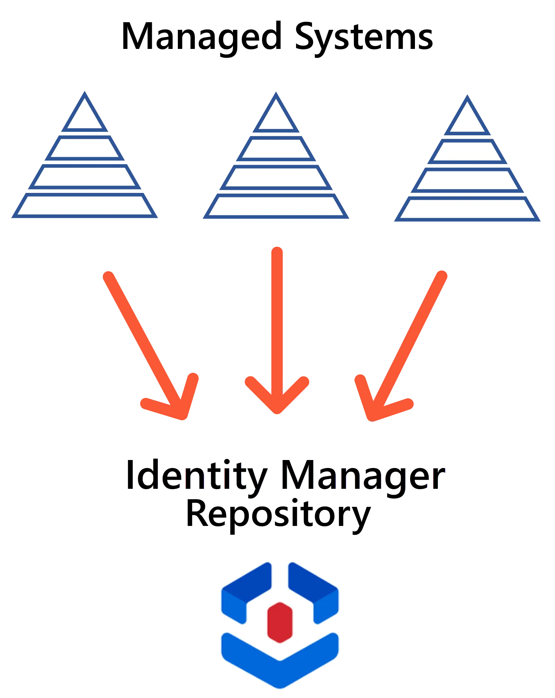
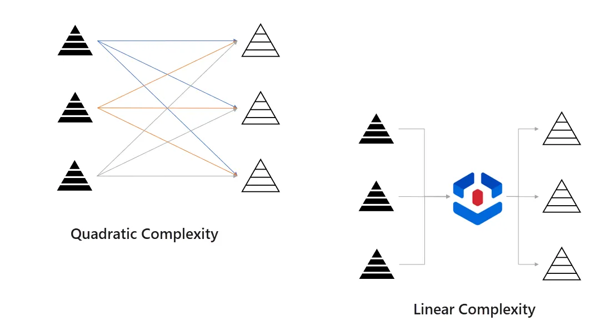
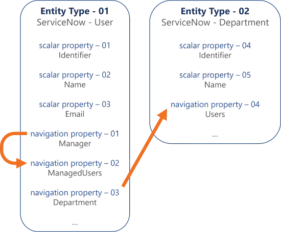

# Identity Management

Managing identities' entitlements requires starting by managing identities themselves.

## A Central Repository

A company involves many sorts of identities: obviously employees, but also external workers like contractors who are usually not tracked in the company's systems except for billing purposes, bots, softwares, etc. All identity types that need to be assigned entitlements to work within the company must be represented.

Companies often use about one system for each identity type. Identity Manager capitalizes on information from several source systems in order to build a central repository meant to contain all the data necessary to manage all identities throughout their whole lifecycle.



Identity Manager's central repository acts as an intermediary between the systems that provide data, for example the HR system, and those that receive data, for example the Active Directory. This greatly reduces the complexity in the links between all systems.

Without an intermediary, adding one system to a set of n systems requires up to n sets of rules, one for each reading/writing relationship that this system has with the others. The complexity is quadratic.
  
Now with the central repository as an intermediary, implementing a new system requires only one more set of rules. The complexity becomes linear.



## An Entity Relationship Model

Identities, along with any IGA-related data, are modeled in Identity Manager by an [entity-relationship model](https://en.wikipedia.org/wiki/Entity%E2%80%93relationship_model?featherlight=true).

All this data is organized and modeled by entities. This concept is quite similar to a database: an entity is a set of properties, some are scalar so "simple" properties, and others are navigation properties which make links between entities, quite like foreign keys in a database.

> For example, consider an entity ```Directory_User``` with properties like ```Name```, ```Email```, ```JobTitle```, ```Department```.
>
> Another entity could be ```Directory_Department```, linked to ```Directory_User``` through a navigation property.
>
> Another entity could be ```SAB_User``` to model SAB accounts owned by users from ```Directory_User```. The accounts from ```SAB_User``` could be related to groups from another entity ```SAB_Group```.



These entities' instances are called resources in Identity Manager. A resource can be the digital identity of a user (human or bot), or an AD account or any other account, or an entry from the HR system, or the representation of a department of the company, etc.

> Consider once more the ```Directory_User``` entity with properties like ```Name```, ```Email```, ```JobTitle```, ```Department```. Then a resource could be the digital identity of an employee whose name is John Smith, with the email address [john.smith@contoso.com](mailto:john.smith@contoso.com) and working as an assistant manager in the accounting department.

While Identity Manager provides a predefined model that should fit most organizations, it can still be adjusted to your exact needs.
Thus, Identity Manager provides a customizable model to organize a company's data according to its IGA-related needs, which is also most reliable because it is kept up-to-date.

## Connectors

Each entity is related to a managed system, for example the Active Directory or SAB or ServiceNow, etc. The reading/writing data between the system and Identity Manager are ensured by connectors. So Identity Manager can be configured with one connector for each managed system.


For a given system, a connector contains:

- the technology which enables data flows between the system and Identity Manager;
- the related entities which model the system's resources;
- the categories which group the system's resources together according to the rules that we want to apply to manage entitlement assignment for this system.

Thus, a connector enables synchronization, i.e. Identity Manager reading from a managed system via an [extract, transform, load](https://en.wikipedia.org/wiki/Extract,_transform,_load) process.


> A typical example is the synchronization of the HR system's data to retrieve employees' personal information.

It also enables provisioning, i.e. Identity Manager writing to a managed system, but that is something we will dig into later.


## Repository Updates

Once Identity Manager is configured, with not only connectors but also roles and rules, etc. (which constitute a different topic), changes can be made to the repository through:

- synchronization, when changes were made in the managed systems and then synchronized, so copied, to Identity Manager;
- manual input, mostly used for a few resources/properties that rarely change such as contractors' identities;
- workflows which contain approval steps to complete before the changes are actually applied;
- the policy's rules that trigger changes to the repository directly, and those that trigger changes to managed systems and impact the repository indirectly after the next synchronization.

See the [
Entitlement Management
](../entitlement-management/index.md) topic for additional information.

## Next Steps

Let's learn about [
Entitlement Management
](../entitlement-management/index.md).

## Learn More

Learn more on 
Identity Management
.

See how to [
Create the Workforce Repository
](../../../user-guide/set-up/initial-identities-loading/index.md).

Learn more on [Connectors](../../../integration-guide/connectors/index.md).

See how to create a [
Connect to a Managed System
](../../../user-guide/set-up/connect-system/index.md).

Learn more on [Synchronization](../../../integration-guide/synchronization/index.md).

Learn more on [Workflows](../../../integration-guide/workflows/index.md).
