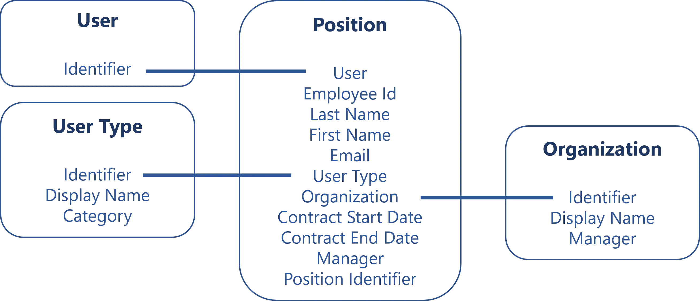
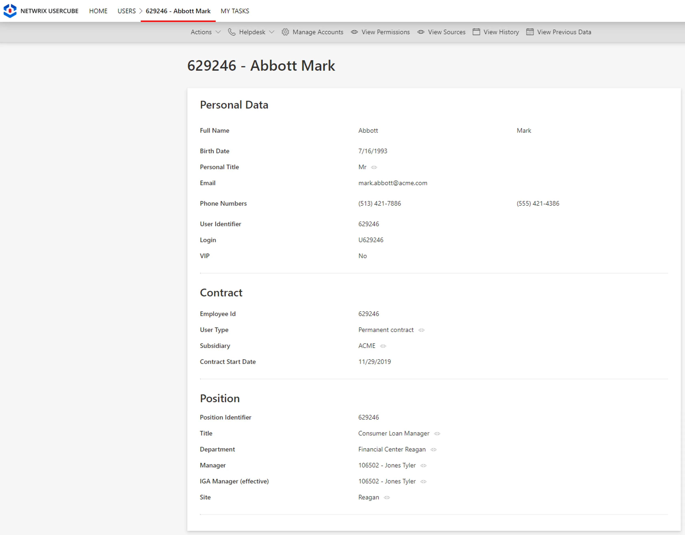

# Create the Workforce Repository

How to initiate the repository for workforce identities by loading identities into Identity
Manager with the right attributes.

## Overview

Loading the digital identities into Identity Manager is the very first task you have to perform,
once you installed the development environment.

The identity repository is supposed to contain the list of all kinds of identities in the company.
Each identity will be represented by a set of properties that are to be used in the calculations for
entitlement assignments.

> For example, a user can be represented by an identifier and linked to their position which
> includes the user's employee id, last name and first name, email, user type, organization, etc.
>
> 

> In Identity Manager, the identity repository can look like the following:
>
> 
>
> 

See the
[ Identity Repository ](../../../integration-guide/identity-management/identity-repository/index.md)
topic for additional information..

The initial workforce repository is going to be the first version of a comprehensive repository
containing all users in the organization. This repository is crucial in setting up the identity
lifecycle management features and managing assignments of entitlements.

### Creation strategy for the workforce repository

In a nutshell, Identity Manager has made it as easy as a copy-paste from employee and contractor HR
files into an MS Excel file.

#### Special properties generation

First, you have to choose rules about how email, login, and internal identifiers are going to be
built for new identities, and for existing identities who do not have these unique properties yet.

#### Organizational model creation

Then, you are going to need a model of the organization's structure where the identities fit in.
This model is supposed to provide valuable information for automation and governance features later.

The model is where you are going to identify for example the type of identities you want to manage
(such as employees and contractors), the hierarchical relationships between them, the geographical
areas they work in, and so on.

Identity Manager has already built a template model for you, in the form of an Excel file. This
basic model is customizable and will be adaptable to most organizations. You can customize it simply
by writing information from your organization into said Excel file.

Even if you have more specific or exotic needs that aren't met by this model, it is still a good
starting point and a good way to quickly start delivering value. We recommend that you start
building your project using this model, identify its limits along the way, and enhance it down the
road to make it fit your needs more accurately.

#### Organizational model filling

Then, you write down the actual identities information, still using the same Excel file, using data
from HR extractions or other records of contractors and temporary workers. As simple as a
copy-paste.

The data you are going to load is analyzed by the engine and some simplifications will be suggested.

**HR synchronization is not enough:**

Another way of handling a part of the initial data loading is to set up an automated synchronization
of HR data with Identity Manager.

While it seems to be a good idea, it poses a few problems. Among them:

- a specific IT infrastructure is required and its implementation is likely to delay the project's
  progress;
- HR data usually misses crucial information (for example contractor data) and is rarely up to date
  early enough to be really useful.

Hence, in order to rather focus on awaited IGA activities, we choose to build the first iteration of
the project upon a manual data upload to create the initial workforce repository. .

## Participants and Artifacts

Integrators may need the help of the HR department and its assistants who know the organization in
order to get the identity and organizational data. After the initial loading, the HR department can
review the data to confirm its accuracy.

| Input                                                                                                                  | Output                       |
| ---------------------------------------------------------------------------------------------------------------------- | ---------------------------- |
| IdentityManagerServer (required) Organizational chart (required)) HR data (required) Third-party staff data (optional) | Initial workforce repository |

## Create the Workforce Repository

Create the workforce repository by proceeding as follows:

1. [ Configure Unique Property Generation ](generate-unique-properties/index.md) for all users,
   pre-existing and new, who do not have them yet.
2. [Load Identities to Identity Manager](load-identities/index.md) to Identity Manager based on the
   recommended attributes from the provided organizational model
   [Template Description](template-description/index.md).
3. [ Adjust the Workforce Data Model ](adjust-datamodel/index.md) following Identity Manager's
   suggestions.
4. Continue with the next steps of this guide, and come back later to fill the organizational model
   with additional data.

## Next Steps

Once the initial identities are loaded, integrators can start the User Profile configuration. See
the [ Configure a User Profile ](../user-profile-configuration/index.md) topic for additional
information.

From there you will be able to keep your repository up to date:

- concerning identity data through workflows;
- concerning the data model

The initial identities loading also enables:

- HR connector creation.
