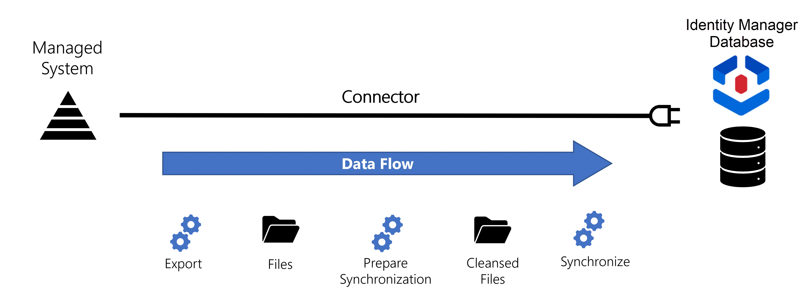
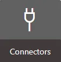
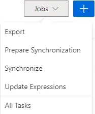
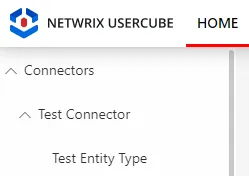
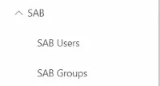
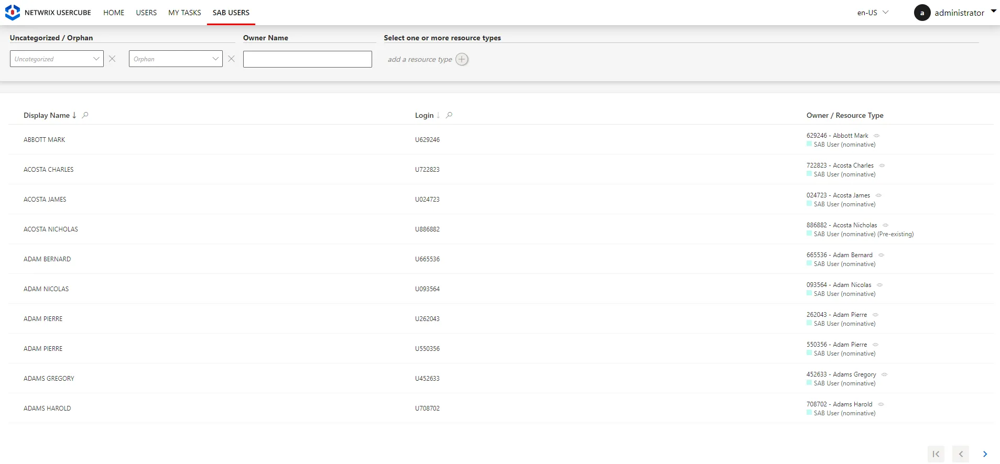
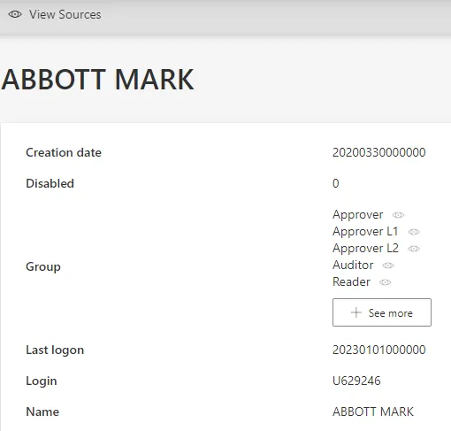

# Synchronize Data

How to launch data synchronization, i.e. read managed systems' data and load it into Identity
Manager.

## Overview

Data synchronization is a data flow from the managed systems into Identity Manager.

### Process

A connector's main purpose is to read and export the data previously mapped with
[Create an Entity Type](../connect-system/entity-type-creation/index.md) in order to synchronize it
with Identity Manager. Connectors provide tools to perform a basic extraction of the system's data
in the form of CSV/XLSX files. These files are cleansed and loaded into Identity Manager.
Synchronization is a three-step ETL process going through export, synchronization preparation and
the synchronization itself.

#### Export

The
[ Export Task ](../../../integration-guide/toolkit/xml-configuration/jobs/tasks/agent/exporttask/index.md)
creates extractions, a snapshot of the managed system's data, used to insert and/or refresh the data
that is inside Identity Manager. Extractions are accessible when there is at least one connection
with an export-enabled
[ References: Packages ](../../../integration-guide/connectors/references-packages/index.md).
Extracted data becomes meaningful when it is loaded into resources as specified by the entity type
structure.

Exported data is stored inside CSV files in the folder `/{InstallationFolder}/Temp/ExportOutput`.

#### Prepare synchronization

The
[ Prepare Synchronization Task ](../../../integration-guide/toolkit/xml-configuration/jobs/tasks/agent/preparesynchronizationtask/index.md)performs
a preparatory data cleansing to spot errors and list them in a generated file in the
`/{InstallationFolder}/Work/Synchronization` folder.

> For example, this task spots an identity if it is linked to an organization code which doesn't
> exist.

#### Synchronize

The `Synchronize` task loads data into Identity Manager's database.

See the
[ Upward Data Synchronization ](../../../integration-guide/synchronization/upward-data-sync/index.md)
topic for additional information.

### Prerequisites

#### Extracted data must have keys

Every extracted resource must have an attribute that serves as a primary key so that Identity
Manager can uniquely identify the resource to be added/updated/deleted during synchronization. You
must have defined keys during Entity Type creation. See the
[Create an Entity Type](../connect-system/entity-type-creation/index.md) topic for additional
information.

Extractions must not be modified before synchronization

Extractions must not be modified manually, for it may induce synchronization issues.

> For example, saving an XLSX file implies an automatic modification of format.

Also, synchronization must not be disturbed by a change in the source format, such as the deletion
of a column in the middle of the file.

Thresholds must never be deactivated

Thresholds are essential safety guards that control all changes, for example preventing the
overwriting of important data by mistake. Thresholds are by default activated to warn users when
synchronization or provisioning triggers too many modifications. If the number of modifications
exceeds the specified threshold, Identity Manager stops the synchronization and displays a warning
_"Threshold Exceeded"_ on the log page described below.

Once the changes have been reviewed, the blocked job can be resumed (or not).

Thresholds are configured with default values using the following
[ Connector ](../../../integration-guide/toolkit/xml-configuration/connectors/connector/index.md)
attributes:

- `MaximumDeletedLines`, `MaximumInsertedLines` and `MaximumUpdatedLines` for scalar properties;
- `MaxPercentageDeletedLines`, `MaxPercentageInsertedLines` and `MaxPercentageUpdatedLines` for
  scalar properties by percentage;
- `MaximumLinkDeletedLines`, `MaximumLinkInsertedLines` and `MaximumLinkUpdatedLines` for navigation
  properties;
- `MaxLinkPercentageDeletedLines`, `MaxLinkPercentageInsertedLines` and
  `MaxLinkPercentageUpdatedLines` for navigation properties by percentage.

## Participants and Artifacts

At this point, integrators should have all the elements they need to perform synchronization.

| Input                                      | Output            |
| ------------------------------------------ | ----------------- |
| Connector with its entity types (required) | Synchronized data |

See the [ Connect to a Managed System ](../connect-system/index.md) topic for additional
information.

## Launch Synchronization

Launch synchronization for a given managed system by proceeding as follows:

1. Access the list of connectors by clicking on **Connectors** on the home page in the
   **Configuration** section.

    

2. On the relevant connector page, in the **Entity Types** frame, click on **Jobs**.

    Here are all the tasks available for synchronization. They synchronize all connections and
    entity types for only this connector. It is possible to launch them individually in order to
    test them and debug a situation, or all together with **All Tasks**. According to the created
    connection(s) and package(s), all these tasks can be launched either in incremental or complete
    mode.

    

    - `Update Expressions`: computes the expressions used in the entity type mapping.
    - `All Tasks`: launches all previous tasks in a row.

    Notice that some connectors, depending on their connections and packages, can't be synchronized
    in incremental mode. As a consequence, when clicking on the **Jobs** button, you wouldn't have a
    choice between `Complete` and `Incremental`. See below this note.

    

## Manage Synchronization Automation

Export and synchronization are executed manually from the connector screens. By default, they are
also part of scheduled [ Jobs ](../../../integration-guide/tasks-jobs/jobs/index.md) provided by
Identity Manager:

- the complete job is scheduled to launch a synchronization once a day of all resources, modified or
  not;
- the incremental job is scheduled to launch a synchronization several times a day only of the
  resources modified since the last synchronization.

See the
[ Set Up Incremental Synchronization ](../../../integration-guide/tasks-jobs/how-tos/jobfast/index.md)
and
[Set up Complete Synchronization](../../../integration-guide/tasks-jobs/how-tos/jobdaily/index.md)
topics for additional information.

Scheduling the jobs avoids manually triggering them everyday.

However, you can choose to withdraw a given connector from both the complete and incremental jobs by
clicking on **Deactivate** on the connector's dashboard. This is particularly useful when modifying
a connector. You can also re-insert it at any time with the same button which is now named
**Activate**.

You can fine-tune the synchronization and/or provisioning of the connector by clicking on the
**Edit** button.

Click on **Job Results** to access the progress of this connector's jobs.

All jobs are accessible on the **Job Execution** page in the **Administration** section.

## Verify an Entity Type's Synchronization

In order to verify both the synchronization configuration and
[Create an Entity Type](../connect-system/entity-type-creation/index.md):

1. Launch synchronization.
2. Access the connector's logs (from **Job Results** on the connector's dashboard) to ensure that
   synchronization completed successfully.

    

3. Check that the entity types have been added to the left menu of the home page.

    

4. Access the relevant entity types (from the menu items on the left of the home page) to check
   synchronized resources, by navigating in the UI from the accounts through a sample of
   associations, via the eye icon:

    

    You should first look for configuration validation, and only later validation of the actual data
    being synchronized.

    > For example, let's say we created a connector for SAB that contains two entity types called
    > `SAB - Users` and `SAB - Groups`. Then, the home page shows them on the left.
    >
    > 
    >
    > Clicking on `SAB - Users` displays the list of all synchronized resources.
    >
    > 
    >
    > Clicking on any resource displays its detailed attributes, for example `Abbott Mark`:
    >
    > 
    >
    > Clicking on any eye icon displays the corresponding resource. SAB was created here with a
    > simple user-group schema that links n users to n groups. So here, we can check these links by
    > navigating from a given user to one of their groups, to one of said group's users, to one of
    > said user's groups, etc.

## Troubleshooting

Make sure you followed the prerequisite guidelines for synchronization.

Keep in mind that a problem observed in synchronized data might also come from a mistake made
previously in the connector's configuration. Therefore, logs can give more details. Logs are
accessible from the **Job Results** button on the dashboard of a given connector.

Don't hesitate to launch synchronization-related tasks individually and observe the corresponding
logs in order to debug a situation.

If the connector and/or entity type doesn't appear in the menu items, then:

Access the relevant connector's page and click on the **Reload** button to take into account the
last changes in the entity type mappings.

If a newly added property doesn't appear in users' data, then:

Access the relevant connector's page to click on the **Reload** button to take into account the most
recent changes in the entity type mappings.

If a synchronization is blocked by an exceeded threshold, then:

Find out the reasons to decide whether or not to bypass the threshold. Proceed as follows:

1. On the logs page (accessible from the **Job Results** button), click on the line of a task
   instance to see its logs.
2. Study synchronization counters and the list of all synchronization changes. These tools help you
   make a decision about whether to bypass synchronization thresholds.

    

    In most cases, the first synchronization exceeds thresholds because no data exists in Identity
    Manager yet. Thus, a high quantity of modifications is expected and the synchronization is to be
    resumed.

    Numerous modifications can also be triggered by:

    - a change in date format;
    - the input of blank files by mistake, because it would overwrite and erase all existing data;
    - a swap of two headers in an input file.

3. If, after verifying, all changes are legitimate, click on the **Resume** button at the top of the
   job progress page. This will restart the job and allow the changes to be synchronized.

    Be cautious, check twice for mistakes before resuming.

    

If an export doesn't complete, then:

- Check the connection's settings.
- If you manually typed the source column of a property in the entity types, then make sure that the
  source column exists in the corresponding managed system.

    

If a given property from users' data is displayed in an unexpected way, then:

Check the format of both the application metadata and the external system.

> For example, if you find that a given date doesn't comply with what you set, then maybe the format
> in the External System section wasn't correctly selected, thus inducing a conversion error during
> the export computation.
